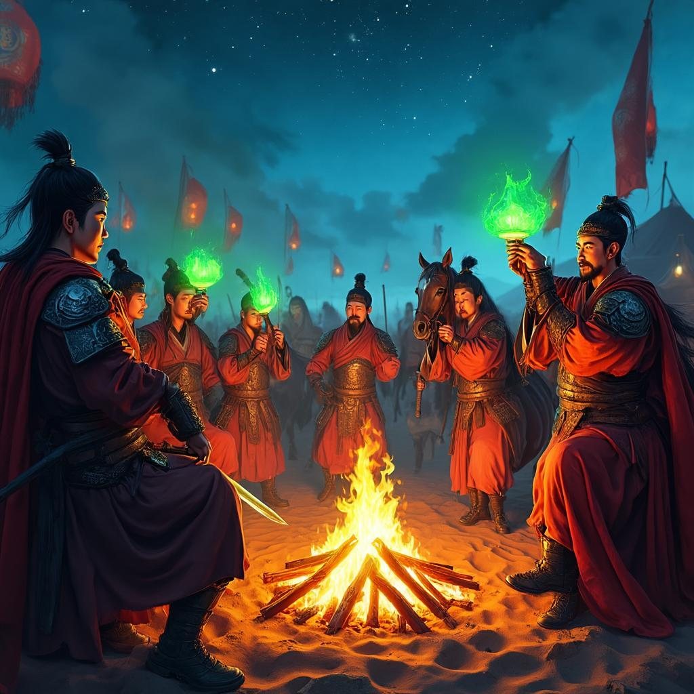

# 凉州曲
**作者**：王翰 ｜ **朝代**：唐代

## 🎵 诗词朗读
<audio controls>
  <source src="./data/mp3/凉州曲_audio.mp3" type="audio/mpeg">
  您的浏览器不支持音频播放。
</audio>

📥 [下载音频文件](./data/mp3/凉州曲_audio.mp3)

## 🖼️ 诗意画境


🖼️ [查看原图](./data/images/凉州曲_王翰.jpg)

---
## 📜 原文
```
葡萄美酒夜光杯，欲饮琵琶马上催。
醉卧沙场君莫笑，古来征战几人回。
```
## 🎯 主题
《凉州曲》通过描绘边塞将士战前饮酒的场景，展现了他们面对生死考验时的豪迈气概与悲壮情怀。诗中"葡萄美酒夜光杯"与"醉卧沙场"形成鲜明对比，既表现了将士们及时行乐的生活态度，也暗示了他们深知"古来征战几人回"的残酷现实。全诗以简洁有力的语言，深刻揭示了战争的残酷本质和生命的脆弱，同时也歌颂了边塞将士在艰苦环境中依然保持的豁达与豪迈，体现了唐代边塞诗特有的悲壮美和人文关怀。
## 🏗️ 结构
王翰的《凉州曲》作为一首七言绝句，其结构特点体现了唐代边塞诗的典型章法布局和层次安排。

从章法布局看，这首诗遵循了绝句"起承转合"的经典结构。首句"葡萄美酒夜光杯"为起句，通过"葡萄美酒"与"夜光杯"两个西域特色物象，立即构建了一个充满异域风情的边塞宴饮场景，为全诗奠定了基调。次句"欲饮琵琶马上催"为承句，既承接上句的宴饮场景，又引入"琵琶"与"马上"两个新元素，形成了安逸与紧张的对比，暗示战争随时可能打断这短暂的欢愉。第三句"醉卧沙场君莫笑"为转句，诗人视角从外在场景转向内心情感，表达了一种豪迈不羁的人生态度。末句"古来征战几人回"为合句，以反问形式点明主题，揭示了战争的残酷本质，使全诗在悲壮中达到高潮。

从层次安排看，这首诗可分为两个清晰的层次。前两句为第一层次，侧重于场景描写和事件叙述，通过具体物象的铺陈，展现了边塞将士短暂欢愉与军旅生活的矛盾。后两句为第二层次，转向情感抒发和哲理思考，从具体场景上升到对生死、战争等宏大主题的探讨，体现了由表及里、由具体到抽象的递进式结构。

值得注意的是，诗中"醉"字起到了承上启下的关键作用，既与前两句的"葡萄美酒"相呼应，又自然引出后两句对生死问题的思考，使全诗结构紧密，过渡自然。此外，对比手法的运用也是这首诗结构上的显著特点：宴饮与催征、豪放与悲凉形成鲜明对比，增强了诗歌的艺术张力和思想深度。

音律结构上，全诗押平声"ei"韵（杯、催、回），节奏鲜明，朗朗上口，与诗歌表达的情感内容高度统一，展现了唐代绝句在形式与内容上的完美结合。
## ✍️ 语言风格
王翰的《凉州曲》作为唐代边塞诗的代表作，其语言风格具有鲜明的特点，主要表现在用词精准凝练、修辞手法丰富多样、整体风格豪放悲壮等方面。

在用词方面，这首诗极为简洁凝练，全诗仅二十八字，却勾勒出一幅生动的边塞将士豪饮图景。诗中"葡萄美酒"、"夜光杯"、"琵琶"等词语不仅简洁，而且带有浓厚的西域风情，反映了凉州作为丝绸之路重镇的多元文化特色。"夜光杯"一词尤为精妙，既点出了酒杯的华美，又暗示了夜晚的场景，具有强烈的形象感。此外，诗中的词语对比鲜明，"美酒"与"沙场"、"醉卧"与"征战"形成强烈对比，增强了诗歌的张力。

在修辞手法上，这首诗运用了多种技巧。首先是对比手法，首句"葡萄美酒夜光杯"与末句"古来征战几人回"形成鲜明对比，前者描写奢华享受，后者揭示战争残酷，这种对比强化了诗歌的悲壮感。其次是设问修辞，末句"古来征战几人回"采用设问方式，引人深思，增强了诗歌的感染力。再次是借景抒情，通过"葡萄美酒"、"夜光杯"、"琵琶"等具体景物，抒发了边塞将士的豪迈情怀。此外，诗中"醉卧沙场"还运用了象征手法，不仅指饮酒后的状态，更象征着将士们面对生死时豁达无畏的精神。

从整体语言风格来看，这首诗呈现出豪放悲壮的特点。全诗语言气势磅礴，特别是"醉卧沙场君莫笑，古来征战几人回"两句，表现了将士们视死如归的英雄气概。同时，诗歌又蕴含着深沉的悲壮之情，诗人并未直接描写战争的残酷，而是通过含蓄的表达，让读者自行体会。在音律方面，全诗平仄协调，音韵优美，"杯"、"催"、"回"押韵，增强了诗歌的音乐美。诗歌通过简洁的语言，营造出开阔的意境，让读者仿佛置身于边塞沙场，感受将士们的豪情与悲壮。

在表现手法上，诗人善于以小见大，通过描绘"葡萄美酒夜光杯"这样的小场景，反映了整个边塞军旅生活的大背景。同时，诗人将边塞的自然环境、军旅生活场景与将士的情感融为一体，实现了情景交融。诗中"葡萄美酒夜光杯"是实写，而"古来征战几人回"则是虚写，虚实结合，增强了诗歌的艺术感染力。

总之，王翰的《凉州曲》通过精准的用词、丰富的修辞手法和豪放悲壮的语言风格，生动地展现了边塞将士的生活状态和精神面貌，成为唐代边塞诗中的经典之作。
## 📚 文化札记
《凉州曲》是唐代边塞诗的代表作品，作者王翰生活在盛唐时期。这首诗蕴含丰富的文化背景和历史文化元素。

"葡萄美酒夜光杯"中，葡萄美酒指由西域传入的葡萄酒，自汉代张骞出使西域后，葡萄种植技术传入中原，至唐代已普遍用于酿酒。葡萄酒在当时是珍贵饮品，象征着异域风情。夜光杯则是传说中的西域宝物，据《十洲记》记载，是用西域白玉精制而成，能在黑暗中发光，周穆王时期曾由西胡献上。这一意象增添了诗的西域色彩和奢华感，反映了唐代中西文化交流的盛况。

"欲饮琵琶马上催"中的琵琶是古代弹拨乐器，原产于西域，汉代传入中原，唐代极为流行。在军队中，琵琶常用于鼓舞士气。"马上催"描绘了在马背上弹奏琵琶催促出征的场景，展现了唐代边塞军队的生活特点。凉州（今甘肃武威）作为丝绸之路上的重要节点和军事重镇，是唐代边塞诗中常见的地点。

"醉卧沙场君莫笑"中的沙场特指西北地区的沙漠战场。"醉卧"反映了军人面对生死未卜的战争时豪放不羁的人生态度，也是唐代文人的一种生活态度体现。"君莫笑"表明诗人意识到这种行为可能被视为轻率，但在战争环境下却是情有可原的，体现了唐代边塞军人的性格特点。

"古来征战几人回"直接点明了战争的残酷性，表达了对生命脆弱的感叹。唐代虽然国力强盛，但边塞战争频繁，许多士兵战死沙场，无法回家。这种对战争残酷性的清醒认识，是唐代边塞诗的常见主题。

整体而言，《凉州曲》通过西域元素（葡萄酒、夜光杯、琵琶）和边塞场景，展现了唐代开放包容的文化特点、边塞军人的豪放精神以及对战争本质的深刻思考，是边塞诗中的经典之作。
## 🌅 创作背景
《凉州曲》是唐代诗人王翰创作于唐玄宗开元年间（约713-741年）的边塞诗名篇。凉州即今甘肃省武威市一带，是唐代西北边防的重要军事据点，也是丝绸之路上的重镇。王翰当时可能因公务或游历来到此地，亲身体验了边塞生活。

王翰（约687-726年），字子羽，太原（今山西太原）人。他性格豪放不羁，喜好饮酒，曾任驾部员外郎等职。在边塞期间，他目睹了戍边将士的艰苦生活和豪迈气概，同时也深刻感受到战争的残酷与无情。这种复杂的生活经历使他的心境既有对边塞壮丽风光的赞美，又有对战争本质的深刻思考。

唐玄宗开元年间是唐朝国力鼎盛时期，为了巩固西北边防，唐朝在凉州等地驻扎大量军队，与吐蕃、突厥等民族时有冲突。这一时期也是唐代边塞诗创作的黄金时代，社会普遍崇尚英雄主义和爱国主义精神，对戍边将士充满敬意。

王翰创作《凉州曲》的动机源于对戍边将士生活的真实观察和深刻体验。诗中"葡萄美酒夜光杯"反映了西域文化对边塞地区的影响，"琵琶马上催"则生动描绘了军中生活的特点。而"醉卧沙场君莫笑，古来征战几人回"则深刻揭示了战争的残酷和生命的无常，表达了诗人对战争本质的思考和对戍边将士的深切同情。这首诗既是对边塞生活的真实写照，也是对战争本质的深刻反思。
## 💭 情感基调
《凉州曲》的情感基调可概括为豪迈悲壮、豁达洒脱。诗中通过"葡萄美酒夜光杯"展现热烈欢快的氛围，又以"欲饮琵琶马上催"形成紧张急促的对比。"醉卧沙场君莫笑"体现了边塞将士不惧生死的豪迈气概，而"古来征战几人回"则流露出对战争残酷性的深刻认识，带有苍凉悲壮色彩。整体氛围呈现出浓郁的边塞风情和军旅气息，欢聚与出征、生与死的强烈对比增强了诗歌的感染力，展现了唐代边塞诗特有的雄浑气势和复杂情感。
## 🔍 赏析
王翰的《凉州曲》是唐代边塞诗的杰出代表，短短四句却蕴含丰富的艺术魅力和深刻的思想内涵。

在意境营造上，诗人以"葡萄美酒夜光杯"开篇，立即构建了一个异域风情浓厚的场景，西域特产与华美器皿的结合，既写实又带有夸张色彩，营造出神秘而奢华的氛围。随后"欲饮琵琶马上催"引入动态元素，形成静态享受与动态军旅的鲜明对比。后两句"醉卧沙场君莫笑，古来征战几人回"将意境推向高潮，以看似轻松实则悲壮的语气揭示战争本质，形成由表及里的艺术递进。

语言特色方面，全诗简洁凝练，用词精准而富有表现力。"催"字极为传神，既表现军令紧迫，又暗示内心矛盾；"君莫笑"运用反语，表面是请求，实则蕴含深刻自嘲；末句"古来征战几人回"的反问加强了对战争残酷性的强调。音韵和谐，节奏感强，"杯"、"催"、"回"的押韵增强了诗歌的音乐美。

情感表达上，诗人展现了复杂的心境：从对边塞生活的热爱，到面对军令的无奈，再到醉卧沙场的洒脱与悲壮，最后升华为对战争本质的深刻思考。这种情感不是单纯的豪放或悲壮，而是一种复杂的混合体，体现了唐代军人特有的精神风貌。

主题思想深刻，通过对比边塞生活的美好与战争的无情，揭示了战争残酷本质和生命可贵，同时展现了唐代边塞诗特有的豪放精神和英雄气概。

作为边塞诗的经典之作，《凉州曲》不仅具有很高的艺术价值，也对后世文学产生深远影响。它所表现的豪放悲壮情怀和对战争与生命的思考，成为后世边塞文学的重要主题，其艺术手法被广泛借鉴，同时它也是了解唐代边塞生活和军人精神的重要窗口，在中国传统文化中占有重要地位。
## 📖 相关作品
出塞 王昌龄，凉州词 王之涣，从军行 杨炯
## 🏷️ 标签
边塞诗,唐诗,盛唐诗歌,七言绝句,军旅生活,战争与和平,边塞风光,生死哲学,豪放,悲壮,爱国,慷慨,伤感,饮酒文化,民族融合,英雄主义
