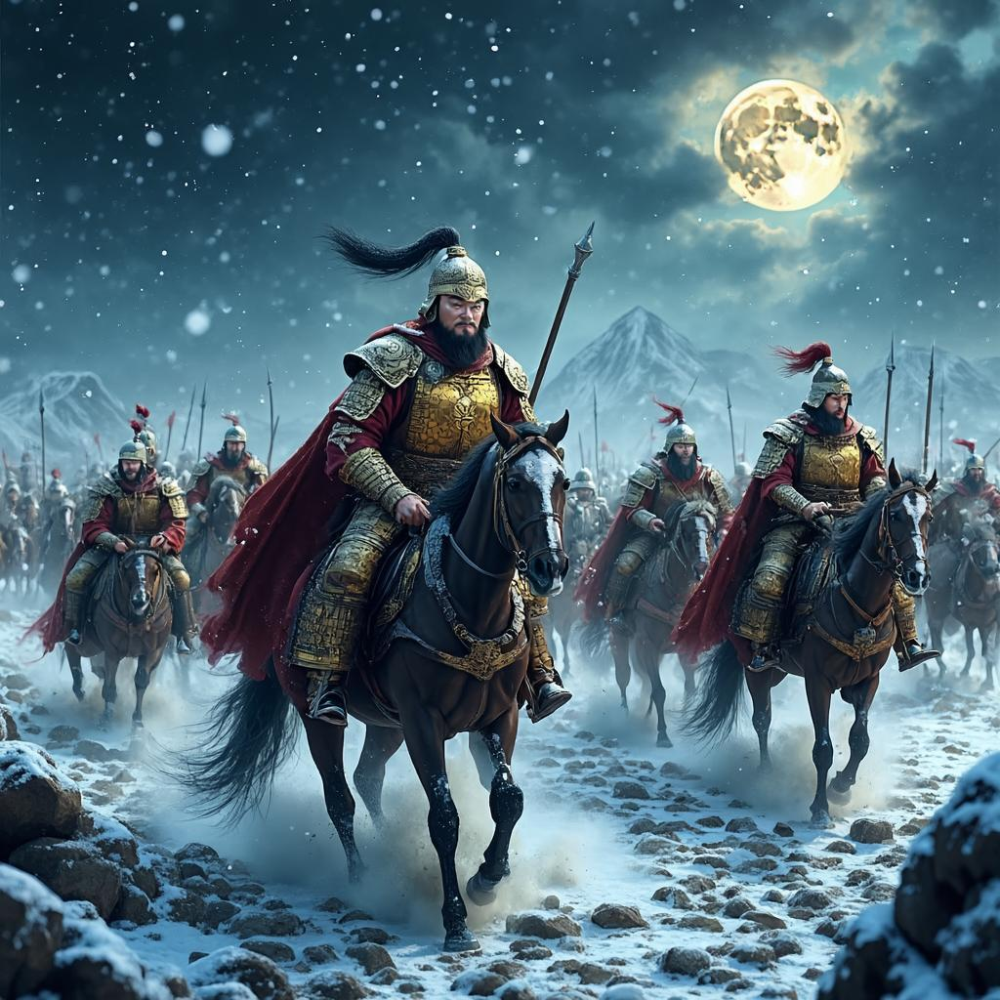

# 轮台歌
**作者**：岑参 ｜ **朝代**：唐代

## 🎵 诗词朗读
<audio controls>
  <source src="./data/mp3/轮台歌_audio.mp3" type="audio/mpeg">
  您的浏览器不支持音频播放。
</audio>

📥 [下载音频文件](./data/mp3/轮台歌_audio.mp3)

## 🖼️ 诗意画境


🖼️ [查看原图](./data/images/轮台歌_岑参.jpg)

---
## 📜 原文
```
轮台九月风夜吼，一川碎石大如斗。
随风满地石乱走，匈奴草黄马正肥。
金山西见烟尘飞，汉家大将西出师。
将军金甲夜不脱，半夜军行戈相拨。
风头如刀面如割，马毛带雪汗气蒸。
五花连钱旋作冰，幕中草檄砚水凝。
虏骑闻之应胆慑，料知短兵不敢接。
车师西门伫献捷。
```
## 🎯 主题
《轮台歌》的主要主题思想是歌颂边塞将士不畏艰险、保家卫国的英雄气概和爱国精神。诗人通过描绘轮台地区恶劣的自然环境——狂风怒吼、碎石乱滚、寒风如刀，以及唐军将士在极端艰苦条件下依然英勇作战的情景，展现了边塞战争的残酷与将士们的坚韧不拔。诗中将军夜不卸甲、军队半夜行军、马匹带雪汗蒸等细节，生动刻画了将士们的顽强意志。最后以"虏骑闻之应胆慑"和"车师西门伫献捷"表达了对唐军战斗力的自信和对胜利的期待，体现了诗人深厚的爱国主义情怀和对国家安定的美好祝愿。整首诗气势磅礴，意境雄浑，是唐代边塞诗的杰出代表。
## 🏗️ 结构
《轮台歌》作为岑参边塞诗的代表作，其结构特点鲜明，章法布局严谨，层次安排有序。全诗共十四句，可分为六个层次，层层递进，展现了边塞战争的全过程。

首先，从章法布局来看，诗歌采用"环境-敌情-行动-困难-准备-胜利"的叙事线索，形成完整的战争画卷。开篇即以轮台九月风夜的恶劣环境切入，直接将读者带入边塞战场，结尾则预期胜利，首尾形成鲜明对比，突出唐军将士的英勇无畏。

在层次安排上，第一层（1-3句）描绘环境："轮台九月风夜吼，一川碎石大如斗。随风满地石乱走"，以夸张手法展现边塞的荒凉险恶，风势之大能吹动斗大碎石，为全诗奠定紧张基调。第二层（第4句）"匈奴草黄马正肥"简洁介绍敌情，暗示战事一触即发。第三层（5-6句）"金山西见烟尘飞，汉家大将西出师"描述战争爆发，汉军出征，战事正式展开。

第四层（7-10句）详细描写行军艰难："将军金甲夜不脱，半夜军行戈相拨。风头如刀面如割，马毛带雪汗气蒸。五花连钱旋作冰"，通过将军不卸甲、士兵夜行军、寒风如刀、汗气结冰等细节，生动展现唐军在恶劣环境中的坚韧不拔。第五层（第11句）"幕中草檄砚水凝"描写战斗准备，砚水凝结的细节再次强调环境的严寒。第六层（12-14句）"虏骑闻之应胆慑，料知短兵不敢接。车师西门伫献捷"表达对胜利的预期，认为敌军必定胆寒，不敢接战，并在车师西门等待捷报。

从结构特点看，诗歌运用了动静结合的手法，既有"风夜吼"、"石乱走"、"烟尘飞"等动态描写，也有"砚水凝"、"伫献捷"等静态描写，使画面更加生动。视角上采用由远及近的布局，从远处的轮台风夜，到金山烟尘，再到将军金甲、马毛带雪等细节，层层深入。同时，诗歌节奏张弛有度，前半部分节奏急促，描绘风沙肆虐的紧张场面；后半部分节奏相对缓慢，描述行军艰辛和预期胜利。

此外，诗中多处运用对比手法，如环境的恶劣与将士的坚韧、敌军的强盛与预期的胆怯等，增强了艺术表现力。通过这种严谨的结构安排，岑参不仅生动展现了边塞战争的全过程，也深刻表达了对唐军将士的赞美和对胜利的期盼，体现了其边塞诗的典型特色和艺术成就。
## ✍️ 语言风格
《轮台歌》是岑参边塞诗的代表作，其语言风格特点鲜明，主要体现在以下几个方面：

首先，从整体语言风格看，这首诗呈现出雄浑豪放、气势磅礴的特点。岑参以简洁有力的笔触，描绘出边塞的严酷环境和将士们的英勇无畏，展现了唐代边塞诗特有的壮美风格。诗中语言朴实无华却充满力量，没有过多修饰，却能准确传达出边塞战争的真实场景和诗人的情感。

在用词方面，岑参表现出精准而生动地选择词汇的能力。动词的运用尤为出色，如"吼"、"走"、"飞"、"出"、"脱"、"拨"、"割"、"蒸"、"凝"等，这些动词不仅准确描述了动作，还赋予了诗句强烈的动感和画面感。例如"轮台九月风夜吼"中的"吼"字，生动地描绘了边塞狂风的咆哮；"半夜军行戈相拨"中的"拨"字，精确地刻画了军队夜间行进时兵器相触的声音和情景。形容词和名词的选择也极具特色，如"大如斗"、"正肥"、"金甲"、"五花连钱"等，这些词汇不仅形象具体，而且富有边塞军旅生活的特色。

在修辞手法上，这首诗运用了多种技巧：

夸张手法的运用十分突出，如"一川碎石大如斗"和"风头如刀面如割"，通过夸张的描写，强调了边塞自然环境的严酷和战争的艰苦，使读者对边塞的恶劣条件有了更深刻的感受。

比喻手法增强了诗歌的形象性，如"风头如刀面如割"将寒风比作刀，形象地表现了风的凛冽刺骨；"马毛带雪汗气蒸"则通过比喻生动描绘了战马在严寒中奔驰时汗水蒸腾又迅速凝结的情景。

对比手法在诗中也多处运用，如自然环境的严酷与将士们英勇无畏的对比；"匈奴草黄马正肥"与"汉家大将西出师"之间的对比，暗示了敌我双方的态势，为下文的战斗做了铺垫。

感官描写丰富多样，诗中综合运用了视觉（"烟尘飞"、"五花连钱旋作冰"）、听觉（"风夜吼"、"戈相拨"）、触觉（"风头如刀面如割"）等多种感官描写，使读者如临其境，全方位感受边塞战争的氛围。

细节描写也是这首诗的一大特色，如"将军金甲夜不脱，半夜军行戈相拨"，通过这一细节表现了将军的警觉和军队的严明；"幕中草檄砚水凝"通过砚水凝结的细节，巧妙地表现了边塞的严寒气候。

侧面烘托的手法也很巧妙，如"虏骑闻之应胆慑，料知短兵不敢接"，通过敌人的反应侧面烘托出唐军的威武和必胜的信心，这种间接描写比直接赞美更有说服力。

意象组合方面，诗中将"风夜"、"碎石"、"烟尘"、"金甲"、"戈相"、"马毛"、"汗气"、"砚水"等边塞军旅生活的典型意象有机组合，构成了一幅生动的边塞战争图景，使诗歌具有很强的画面感和感染力。

动静结合的技巧也运用得恰到好处，诗中既有"风夜吼"、"石乱走"、"烟尘飞"等动态描写，也有"砚水凝"等静态描写，动静结合，使画面更加生动立体。

整体结构上，这首诗按照时间顺序展开，从夜晚的狂风到白天的行军，再到预期的胜利，层次分明，结构紧凑，首尾呼应，完整地展现了边塞战争的一个片段，体现了岑参诗歌构思的严谨和完整。

综上所述，《轮台歌》通过雄浑豪放的语言风格、精准生动的用词和丰富多样的修辞手法，成功地塑造了边塞战争的壮阔场景，展现了唐代将士们的英勇无畏，体现了岑参边塞诗的独特艺术魅力。
## 📚 文化札记
《轮台歌》是唐代著名边塞诗人岑参的代表作，描写了唐军在西域轮台一带与匈奴作战的情景。以下是这首诗中重要的文化背景注释：

轮台：古代西域地名，位于今天新疆维吾尔自治区轮台县一带，是唐代安西都护府辖区的重要军事据点，也是丝绸之路上的重要站点。唐代在此设有军镇，是防御北方游牧民族入侵的前沿阵地。

匈奴：古代北方游牧民族，秦汉时期中原王朝的主要边患。到了唐代，突厥等民族取代了匈奴的地位，但唐诗中仍常以"匈奴"泛指北方游牧民族，这是一种文学上的借代手法。

金山：即阿尔泰山，位于今天新疆北部和蒙古西部，是古代西域的重要山脉。"金山"因其山色金黄而得名，在唐代边塞诗中常被提及。

汉家：指唐朝。唐诗中常以"汉"代"唐"，这是一种借古喻今的手法，既符合诗歌的韵律要求，又能唤起读者对历史上汉匈战争的联想。

金甲：指将军所穿的金属铠甲，在月光或火光下闪闪发光。唐代将军的铠甲多为铁制或铜制，镀金后称为"金甲"，是高级将领的装备。

戈相拨：戈是古代长柄武器，这里指士兵行军时兵器相互碰撞发出的声音，生动描绘了军队夜间行军的场景。

五花连钱：形容马身上的花纹，"五花"和"连钱"都是形容马毛斑驳美丽的词语。唐代名马常有此类花纹，是良马的标志。

幕中草檄：在军帐中起草军事文书（檄文）。檄文是古代用于征召、声讨或宣布军事行动的文书，在军事行动中具有重要作用。

砚水凝：写檄文时，砚台中的墨水都结冰了。这一细节生动地表现了边塞的严寒环境，也反映了即使在恶劣条件下，军中文书工作仍在进行。

虏骑：指敌军骑兵。"虏"是古代中原王朝对北方游牧民族的蔑称，体现了当时的文化观念和民族关系。

短兵不敢接：指敌人不敢与唐军进行近距离战斗。"短兵"指短兵器，如刀、剑等，代指近身搏杀。这反映了唐军的威武和敌人的畏惧。

车师：古代西域国名，位于今天新疆吐鲁番一带，是丝绸之路上的重要国家。汉代时已被纳入中原王朝版图，唐代时是安西都护府辖区的一部分。

伫献捷：等待胜利的消息。"伫"是等待的意思，"献捷"指报告胜利的消息。在古代军事文化中，胜利后需要在特定地点（如城门）举行献捷仪式，以宣告胜利并鼓舞士气。

这首诗通过生动的意象和细节，展现了唐代边塞的严酷环境和将士们的英勇精神，也反映了唐代与西域各族的复杂关系，是边塞诗中的经典之作。
## 🌅 创作背景
《轮台歌》创作于唐玄宗天宝十三载（754年）左右，当时岑参正在安西都护府（今新疆库车一带）担任节度判官。轮台是古代西域重要城市，位于今天新疆轮台县一带，是唐代丝绸之路上的关键节点，也是安西都护府的辖区。岑参身处西域边陲，亲身体验了边塞的艰苦环境和军旅生活，这为他创作提供了真实素材。

创作此诗时，岑参已年近四十，正值第二次出塞。他最初怀着建功立业的雄心壮志来到边塞，但现实与理想存在巨大差距。在边塞，他面临严酷的自然环境、军旅生活的艰辛以及远离家乡的孤独。从诗中可以看出，岑参对边塞生活有着深刻的体验，既描绘了边塞的壮阔景象，也表现了戍边将士的艰苦生活。此时的心境复杂，既有对边塞壮丽风光的赞叹，也有对战争残酷性的认识，以及对家乡的思念之情。

唐玄宗天宝年间（742-756年）是唐朝由盛转衰的关键时期。表面上国力强盛，实则内部已出现诸多问题。西北边疆时常发生战事，唐朝为维护丝绸之路畅通和边疆安全，经常在西域地区用兵。《轮台歌》所反映的正是这一历史背景下，唐军在西域与匈奴（可能指突厥或其他游牧民族）作战的情况。当时的社会环境中，边疆战事不断，戍边将士生活艰苦，而朝廷内部却日益腐朽，最终导致了天宝十四年（755年）安史之乱的爆发。

岑参创作《轮台歌》的动机有多方面。作为亲历边塞生活的诗人，他希望通过诗歌记录边塞的壮丽风光和军旅生活的真实情况；同时表达对戍边将士的敬意和对战争的思考；作为有政治抱负的文人，他也想通过诗歌展现自己的才华和对国家的忠诚。诗中描绘的"轮台九月风夜吼，一川碎石大如斗"等景象，都是他亲眼所见的边塞自然风光；而"将军金甲夜不脱，半夜军行戈相拨"等描写，则反映了他对军旅生活的深刻体验。这些真实的经历和感受，成为了他创作这首诗的直接灵感来源。
## 💭 情感基调
《轮台歌》的情感基调以雄浑悲壮为主，氛围特点则表现为严酷肃杀。诗中通过"风夜吼"、"碎石大如斗"、"风头如刀面如割"等意象，勾勒出边塞环境的极端恶劣；"将军金甲夜不脱"、"半夜军行戈相拨"则展现了军营的紧张氛围。然而，在如此艰苦条件下，汉军依然西出师，表现出将士们的豪迈气概和坚定自信。全诗既有对严酷环境的真实描绘，又有对战争必胜的坚定信念，形成了边塞诗特有的苍凉雄浑之美，体现了唐代边塞诗的典型风格。
## 🔍 赏析
《轮台歌》是岑参边塞诗的代表作，通过生动的笔触描绘了唐代军队在轮台与匈奴作战的壮烈场景。在意境营造上，诗人以"轮台九月风夜吼"开篇，直接点明环境的恶劣，"吼"字赋予风以生命力和威胁感。夸张手法如"一川碎石大如斗"、"随风满地石乱走"生动展现了边塞的荒凉与狂暴。全诗采用由远及近、由大到小的描写顺序，从自然环境到敌我状态，再到将军士兵的具体表现，最后展望战争结果，层次分明，结构严谨。

语言特色上，诗歌刚健有力，动词运用精准有力，"吼"、"飞"、"脱"、"拨"、"割"等字使全诗节奏明快，充满动感。修辞手法丰富，夸张如"风头如刀面如割"，比喻形象，排比句式如"将军金甲夜不脱，半夜军行戈相拨"增强了气势。细节描写如"马毛带雪汗气蒸"、"幕中草檄砚水凝"等，通过微小而具体的场景，生动表现了边塞的严寒和军旅生活的艰苦。

情感表达方面，诗人虽未直接抒情，但通过对艰苦环境和将士们英勇行为的描写，表达了对戍边将士的深切同情和由衷敬佩。主题上展现了唐代军队在极端恶劣环境下坚持战斗、保家卫国的精神风貌，"汉家大将西出师"和"车师西门伫献捷"等诗句，表达了诗人对国家统一和边疆稳定的渴望，以及对唐军必胜的信心。

《轮台歌》作为边塞诗的经典之作，具有重要的文学价值。其鲜明的意象、生动的描写、有力的语言和严谨的结构，体现了岑参诗歌的艺术特色，对后世边塞诗的创作产生了深远影响。从历史角度看，它真实反映了唐代边疆战争的现实；从文化传承角度看，诗中体现的爱国主义精神、不畏艰难的奋斗精神，成为中华民族精神文化的重要组成部分，至今仍具有深刻的现实意义。
## 📖 相关作品
白雪歌送武判官归京 岑参，凉州词 王之涣，从军行 王昌龄
## 🏷️ 标签
边塞诗,唐诗,现实主义,战争题材,边塞生活,爱国情怀,军旅诗,雄浑豪放,悲壮,坚毅,写实主义,夸张手法,对比手法,岑参代表作,唐代边塞诗,军事描写,自然环境描写,英雄主义
