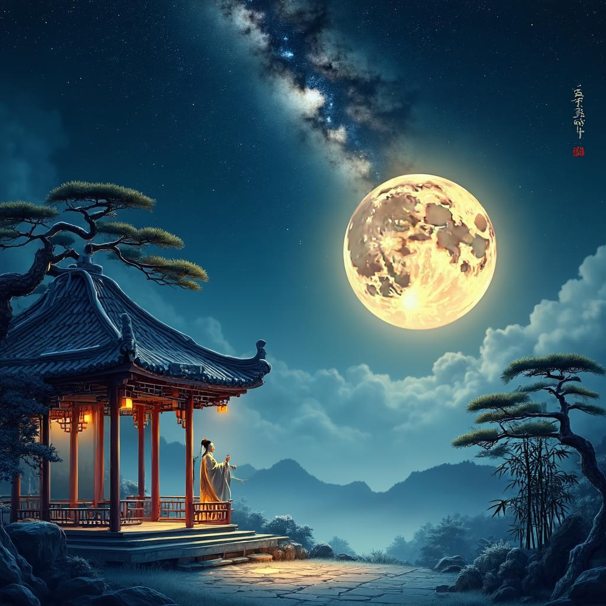

# 中秋月
**作者**：苏轼 ｜ **朝代**：宋代

## 🎵 诗词朗读
<audio controls>
  <source src="./data/mp3/中秋月_audio.mp3" type="audio/mpeg">
  您的浏览器不支持音频播放。
</audio>

📥 [下载音频文件](./data/mp3/中秋月_audio.mp3)

## 🖼️ 诗意画境


🖼️ [查看原图](./data/images/中秋月_苏轼.jpg)

---
## 📜 原文
```
暮云收尽溢清寒，
银汉无声转玉盘。
此生此夜不长好，
明月明年何处看。
```
## 🎯 主题
苏轼的《中秋月》主要表达了人生短暂与时光易逝的感慨。诗人通过描绘中秋月色的清冷纯净，引发对生命无常的思考。前两句以"暮云收尽"、"银汉无声"勾勒出静谧澄澈的月夜景象，后两句则由美景转入人生感悟，点明"此生此夜不长好"的哲理，并以"明月明年何处看"的疑问，表达了对未来的不确定感和对当下美好时光的珍惜。整首诗在咏月中融入了深刻的人生哲理，体现了苏轼豁达而又略带忧伤的人生态度。
## 🏗️ 结构
苏轼的《中秋月》作为一首七言绝句，在结构上展现了严谨的章法布局和精巧的层次安排。全诗共四句，遵循绝句"起承转合"的传统结构模式，每一句各司其职，共同构成一个完整的艺术整体。

从章法布局看，第一句"暮云收尽溢清寒"为"起"，交代时间背景和环境氛围。暮云散去，夜空清澈，月光带来清寒之感，为全诗奠定了基调。第二句"银汉无声转玉盘"为"承"，承接前句意境，进一步描绘月亮的形态与运行，将月亮比作玉盘，银河静谧无声，深化了月夜的宁静氛围。这两句共同构成了诗歌的写景部分，意境开阔而清远。

第三句"此生此夜不长好"为"转"，开始由写景转向抒情，表达诗人对当下美好时光短暂的感慨，情感基调发生变化。第四句"明月明年何处看"为"合"，收束全诗，将情感推向高潮，表达对未来的不确定感和对当下的留恋，点明人生无常的主题。

从层次安排看，全诗可分为两个层次：前两句为写景层次，通过"暮云"、"清寒"、"银汉"、"玉盘"等意象，营造出中秋月夜的清冷宁静氛围；后两句为抒情层次，表达诗人对时光流逝的感慨和对未来的思考。这种由景入情的层次安排，使诗歌在结构上形成由外而内、由客观到主观的递进关系。

此外，诗歌在结构上还体现出时间线索的流动，从"暮云"的当下时刻，到"明年"的未来展望，形成了时间的延展，增强了诗歌的时空感。同时，前两句的客观景物与后两句的主观情感形成鲜明对比，使诗歌结构更加丰富多变。

整体而言，苏轼的《中秋月》结构严谨而灵活，层次分明而自然，通过精妙的章法布局和层次安排，实现了形式与内容的完美统一，展现了诗人高超的艺术技巧和深厚的情感内涵。
## ✍️ 语言风格
苏轼的《中秋月》语言风格清新自然，含蓄深沉，体现了苏轼诗歌"豪放中见婉约，平淡中见奇崛"的艺术特色。

在用词方面，此诗极为精炼凝练。"暮云收尽"四字勾勒出傍晚云彩消散的景象，"溢清寒"三字生动传达出夜晚的清冷气息。诗中选用"银汉"、"玉盘"等典雅词汇，既具古典韵味，又含蓄地描绘了月亮和银河的美丽景象。这些词语创造了鲜明的意象，使读者能直观感受到中秋夜的清冷和月亮的皎洁。

修辞手法上，诗人运用了多种技巧。将月亮比作"玉盘"，形象生动，既表现了月亮的形状，又暗示了其洁白晶莹。"银汉无声转玉盘"中的"转"字，赋予银河以人的动作，使静态景象变得生动。前两句描绘宁静美好的月夜景象，后两句转向对人生无常的感慨，形成鲜明对比，增强了诗歌的感染力。"明月明年何处看"是一个设问句，表达了诗人对未来的不确定感和对美好时光易逝的惋惜。

在表现手法上，诗人采用由景入情的方式，前两句写景，后两句抒情，由外在景象自然过渡到内心感受，层次分明。诗中既有对眼前实景的描绘，又有对未来的想象和思考，虚实结合，丰富了诗歌的内涵。通过对中秋月夜的描写，折射出诗人对人生、时光的深刻思考，体现了以小见大的艺术手法。

意境营造方面，通过"清寒"、"无声"等词语，营造出中秋夜清冷幽静的意境。银汉、明月等意象给人以阔远深邃之感，拓展了诗歌的想象空间。后两句对人生无常的感慨，为诗歌增添了深沉的哲理意味，使意境更加丰富。

音韵上，全诗押"寒"、"盘"、"看"韵，音韵和谐，增强了诗歌的音乐性。诗中平仄相间，读来抑扬顿挫，富有节奏感。

总的来说，这首《中秋月》语言精炼，意境深远，情景交融，既展现了苏轼高超的语言艺术，也反映了他对人生的深刻思考，是中国古典诗歌中的佳作。
## 📚 文化札记
《中秋月》是苏轼在宋代创作的一首咏月诗，蕴含丰富的文化背景和深刻的人生感悟。

"暮云收尽溢清寒"一句描绘了中秋之夜天空的景象。在中国传统文化中，中秋是农历八月十五的重要节日，正值秋季，天气转凉，故有"清寒"之感。古人认为中秋之夜月亮最圆最亮，象征着团圆和美满。苏轼通过"暮云收尽"表现出云彩散去后天空的清澈，为明月出现做了铺垫。

"银汉无声转玉盘"中的"银汉"指银河，在中国古代天文学和神话传说中有着重要地位。最著名的传说是牛郎织女被银河隔开，每年七夕才能相会的故事。"玉盘"是对月亮的美称，形容中秋圆月圆润洁白如玉盘，这一比喻在古典诗词中常见，如李白"小时不识月，呼作白玉盘"。此处苏轼将银河与月亮并置，营造出静谧而壮美的夜空景象。

"此生此夜不长好"一句体现了中国传统文化中的"人生无常"思想。苏轼感叹美好的中秋之夜不会长久，这反映了他对生命短暂的深刻感悟。这种对时光流逝、美好易逝的感慨是中国古典诗词的常见主题，也体现了苏轼作为文人对人生的哲理思考。

"明月明年何处看"表达了苏轼对未来的不确定感。结合苏轼的生平经历，他一生仕途坎坷，多次被贬谪，辗转各地，因此对"何处看"有着特别的感受。这句诗既是对未来行踪未卜的忧虑，也暗含了对人生聚散无常的感慨，体现了中国文人特有的漂泊感和对命运的思考。

整体而言，这首诗通过描绘中秋明月，表达了苏轼对美好事物的赞美，同时也融入了他对人生短暂、命运无常的深刻感悟，体现了宋代文人特有的哲理思考和人生态度。
## 🌅 创作背景
苏轼的《中秋月》创作于宋神宗熙宁七年（1074年）中秋节，当时他正在密州（今山东诸城）任知州。这一时期，苏轼因反对王安石变法，自请外放，先后出任杭州通判、密州知州等职，处于政治生涯的低谷期。

在密州期间，苏轼的生活状况相对稳定但心境复杂。他虽然远离朝廷政治斗争的漩涡，获得了一定的自由，但内心仍怀有报国之志，同时对政治前途感到忧虑。这首诗中"此生此夜不长好，明月明年何处看"的感慨，正是他当时心境的真实写照，反映了对人生无常、前途未卜的深刻思考。

从历史背景看，当时北宋正处于王安石变法（熙宁变法）时期，朝廷内部因变法问题分裂为新旧两党，政治斗争激烈。苏轼作为旧党代表人物，因直言进谏而遭到排挤，被贬谪到地方任职。这一时期，北宋社会表面繁荣，但内部矛盾已经显现，为后来的靖康之变埋下隐患。

苏轼创作这首诗的动机主要源于中秋佳节这一特殊时间节点。中秋是中国传统团圆节日，而苏轼身在异乡，远离京城和亲人，面对皎洁的明月，触景生情，产生了对人生、命运的深刻感悟。诗中前两句描绘了中秋夜晚的宁静美丽，后两句则抒发了对人生短暂、前途未卜的忧思，既有个人生活体验的抒发，也有对时代背景的深刻反思。
## 💭 情感基调
《中秋月》一诗的情感基调可概括为清寂感伤、珍惜当下。诗人描绘中秋夜景时，流露出对美好时光短暂的深切感慨，尤其是"此生此夜不长好"一句，直接表达了对美好时刻易逝的惋惜。末句"明月明年何处看"更增添了人生无常、漂泊不定的忧思。

氛围特点可概括为清冷宁静、空灵深远。诗中"暮云收尽溢清寒"、"银汉无声转玉盘"等意象，营造出一种澄澈、静谧的月夜氛围，清寒中透着空灵。整首诗在静谧的月色背景下，融入诗人深沉的人生感悟，形成一种既清冷又深远的艺术氛围，体现了苏轼在赏景中的哲思情怀。
## 🔍 赏析
苏轼的《中秋月》以简洁凝练的语言，营造了一个清冷宁静而又略带忧伤的中秋月夜意境。首句"暮云收尽溢清寒"中，"溢"字极为精妙，既表现了月光如水般流淌的动态感，又暗示了寒意的弥漫。第二句"银汉无声转玉盘"以"银汉"代指银河，"玉盘"比喻明月，整个画面静谧而优美，银河无声，明月如玉盘般缓缓转动，营造出超然物外的宁静感。诗人运用动静结合的手法，前两句以静态描写为主，但"溢"和"转"两个动词又赋予了画面以动态感，后两句则由外景转向内情，形成由景入情的艺术转换。

语言特色上，这首诗简洁凝练而意境深远。"溢清寒"三字，既描绘了月光的流动，又传达了秋夜的凉意，还暗示了诗人内心的感受。修辞技巧方面，"玉盘"的比喻生动形象，"银汉"的借代增添了典雅气息。"此生此夜"和"明月明年"的对仗工整，音韵和谐，增强了诗歌的音乐美。末句"明月明年何处看"的设问，既是对未来的疑问，也是对人生无常的感慨，含蓄而深刻。

情感表达上，这首诗流露出对美好时光的珍惜和对人生无常的感慨。"此生此夜不长好"直接表达了诗人对美好时光短暂的感叹，"明月明年何处看"则进一步深化了这种情感，表达了对未来的不确定性和对人生变迁的思考。主题上，诗歌探讨了时间与人生的关系，中秋月本是中国传统文化中团圆的象征，但诗人却从中感受到了人生的无常和变迁，体现了苏轼作为思想深刻文人的哲学思考。

《中秋月》作为苏轼的代表作之一，展现了宋代文人"情景交融"的审美追求。它不仅丰富了中秋题材的诗歌创作，也为后世文人提供了一种将自然景观与人生感悟相结合的创作范式。诗中"此生此夜不长好，明月明年何处看"的感慨，成为表达人生无常的经典名句，被后人广泛引用。此外，这首诗也体现了苏轼豁达而又略带忧伤的人生态度，面对人生的无常，既不悲观绝望，也不盲目乐观，而是以一种平和的心态接受现实，这种人生态度对后世产生了积极影响。
## 📖 相关作品
水调歌头·明月几时有 苏轼，望月怀远 张九龄，十五夜望月 王建
## 🏷️ 标签
宋诗,古文运动,中秋咏月,节令诗,写景抒情,哲理思考,思乡之情,感伤,怀旧,忧思,宋代文学,咏物诗,抒情诗,哲理诗,七言绝句,苏轼代表作
