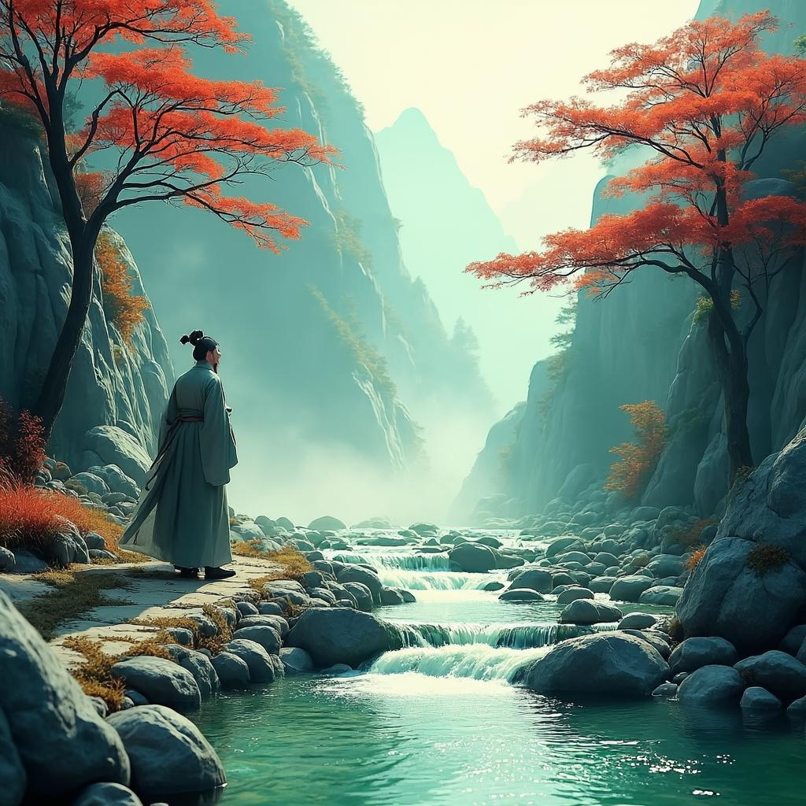

# 山中
**作者**：王维 ｜ **朝代**：唐代

## 🎵 诗词朗读
<audio controls>
  <source src="./data/mp3/山中_audio.mp3" type="audio/mpeg">
  您的浏览器不支持音频播放。
</audio>

📥 [下载音频文件](./data/mp3/山中_audio.mp3)

## 🖼️ 诗意画境


🖼️ [查看原图](./data/images/山中_王维.jpg)

---
## 📜 原文
```
荆溪白石出，天寒红叶稀。
山路元无雨，空翠湿人衣。
```
## 🎯 主题
王维的《山中》主要主题是描绘深山幽静的景色，并借此表达诗人与自然融为一体的超然心境。诗人从视觉上的“白石”、“红叶”等具体物象，逐步转向“空翠湿人衣”这种独特的感官体验。这里的“空翠”并非指具体的绿植，而是山中湿润、清新的空气所弥漫的整体气息与生命活力。诗人行走于无雨的山路，衣衫却被这弥漫的翠意所浸润，这是一种超越了视觉、触觉的通感，象征着诗人精神上完全融入自然，达到了物我两忘的境界。全诗营造出一种宁静、空灵而又充满生命意趣的氛围，体现了王维山水诗中禅意与画意结合的典型特征。
## 🏗️ 结构
王维的《山中》作为一首五言绝句，其结构特点体现了唐代山水诗的精妙构思。从章法布局来看，这首诗采用了典型的"起、承、转、合"结构模式。首句"荆溪白石出"起兴，以具体景象引入诗境；第二句"天寒红叶稀"承接首句，进一步点明季节特征；第三句"山路元无雨"为转折，引入新情境；末句"空翠湿人衣"收束全诗，点明主题，创造出空灵意境。

在层次安排上，此诗呈现出由实到虚、由外而内的递进关系。前两句"荆溪白石出，天寒红叶稀"描绘具体可见的秋日山景，属于外在景象的写实；后两句"山路元无雨，空翠湿人衣"则转向对山间特殊氛围的感受，尤其是末句将视觉感受转化为触觉感受，实现了感官的转换与融合，属于内在体验的描写。

从空间结构看，诗歌呈现出由下而上、由近及远的布局："荆溪白石出"描绘低处溪流，属于近景；"天寒红叶稀"描绘山间树木，视野稍有扩展；"山路元无雨"将视角拉到诗人行走的路径；"空翠湿人衣"则将整个山间的翠绿气息融为一体，创造出一种笼罩全身的空间感受。

在虚实结合方面，前两句写实，描绘具体的自然景象；后两句写虚，尤其是"空翠湿人衣"一句，将无形的"翠"（山间绿意）拟物化，赋予其"湿"的质感，是典型的虚写手法，却给人真实可感的体验，体现了王维诗歌"诗中有画"的艺术特色和禅宗思想影响下的空灵意境。

此外，诗中还暗含多重对比结构：色彩上白石与红叶形成对比；季节上天寒时节与山间翠绿形成对比；感官上视觉与触觉形成对比与融合；实际上"无雨"与感觉上"被湿"形成虚实对比。这些对比结构丰富了诗歌的内涵，增强了艺术表现力。
## ✍️ 语言风格
王维的《山中》是一首典型的山水田园诗，体现了诗人"诗中有画"的艺术特色。从语言风格特点来看，主要有以下几个方面：

用词方面，王维善于选用简洁而富有表现力的词语。全诗仅二十字，却勾勒出丰富的山水意象。"荆溪白石出"一句中，"白石出"三字极为精炼，既表现了溪水清澈见底，又暗示了水位下降的秋季特征。"天寒红叶稀"中的"稀"字准确捕捉了秋天红叶开始凋零的景象，用字极为精准。诗中还运用了"白"、"红"、"翠"等色彩词，构成了一幅色彩对比鲜明的秋山图，使画面更加生动。

修辞手法上，这首诗运用了多种技巧。首先是对比手法，"白石"与"红叶"形成冷暖色调的对比，"天寒"与"空翠"形成季节与生命力的对比，"无雨"与"湿人衣"形成虚实对比，增强了诗歌的艺术张力。其次是拟人手法，"空翠湿人衣"将绿色的草木赋予能"湿"人的特性，生动表现出山中草木茂盛、绿意盎然的景象。此外，诗中还采用了象征手法，"天寒红叶稀"不仅是对自然现象的描述，也象征着秋天深入，万物开始凋零的季节特征。

句法结构上，前两句写景，后两句抒情，层次分明。前两句"荆溪白石出，天寒红叶稀"描绘静态的山水景色，后两句"山路元无雨，空翠湿人衣"则通过人的感受来表现山中环境的湿润与生机，形成由外而内、由景到情的结构转换。

表现手法上，王维擅长以小见大，通过"白石出"、"红叶稀"等细微景象展现整个山中秋景。同时，诗中虚实结合，既有实景描写，又有虚景表现，使诗歌意境更加深远。特别是"空翠湿人衣"一句，将视觉感受转化为触觉感受，体现了诗人独特的感知能力和表现手法。

整体风格上，这首诗体现了王维诗歌清淡自然的特点，语言平淡无华却意蕴深远。诗中情景交融，既有山水的清冷萧瑟，又有自然的生机与活力，蕴含着"无中见有"的禅理，展现了王维作为"诗佛"的独特风格和深厚的艺术造诣。
## 📚 文化札记
王维的《山中》一诗，虽篇幅短小，却意蕴丰厚，堪称其“诗中有画，画中有诗”风格的典范。要深入理解此诗，需了解其背后蕴含的文化背景。

首先，关于作者王维的背景。王维是唐代著名诗人，官至尚书右丞，故世称“王右丞”。他晚年笃信佛教，过着半官半隐的生活，尤其在辋川别业（今陕西蓝田县境内）的隐居时期，创作了大量描绘山水田园、充满禅意的诗歌，因此后人尊称他为“诗佛”。这一身份至关重要，因为它决定了王维观察自然的方式——并非单纯的客观描摹，而是融入了禅宗的空灵与静观。诗中那种不染尘俗、物我两忘的意境，正是其内心禅修境界的外化。

其次，诗中提到的“荆溪”并非泛指。荆溪是实有其地，位于唐代长安东南的蓝田县，是王维辋川别业附近的一条真实溪流。辋川别业是王维精心营建的山水园林，是他精神上的栖息地。因此，诗中所写的“荆溪”、“山路”，都是诗人日常起居、游心观照的真实环境。了解这一点，我们便能明白这首诗并非凭空想象的风景画，而是诗人对自己所熟悉的隐居环境的真实感受与艺术提炼。这层个人化的印记，使得诗歌的情感更加真挚可感。

再者，诗中的意象与禅宗思想紧密相连。“山路元无雨，空翠湿人衣”是全诗的点睛之笔，也是最富文化内涵的一句。从字面看，山路本来没有下雨，但那满山的苍翠欲滴的绿色，仿佛带着水汽，沾湿了行人的衣裳。这里的“空翠”是一个极富创造力的词汇，它不是指具体的水雾或雨丝，而是指弥漫于山间空气中的、由茂盛草木所蒸腾起的浓绿湿润的气氛。这种“湿”的感觉，是一种通感，是视觉（翠）向触觉（湿）的转化。更深一层看，这与禅宗“空”的观念相通。“空翠”之“空”，既指山中并无实质的雨水，也暗含了佛家“万法皆空”的哲理。然而，这种“空”并非虚无，它却能产生“湿人衣”的真实感受。这正体现了禅宗“真空妙有”的思想：在空寂的境界中，蕴含着无限的生机与实在。诗人通过这一奇妙的感官体验，传达出一种超越逻辑、直指本心的禅悟。

最后，此诗体现了中国古典美学中“诗画一律”的最高追求。宋代大文豪苏轼评价王维“味摩诘之诗，诗中有画；观摩诘之画，画中有诗”。《山中》便是绝佳例证。“荆溪白石出，天寒红叶稀”两句，色彩对比鲜明（白与红），构图层次清晰（近景溪流，远景山色），如同山水画中的特写与远景的结合，精准地捕捉了深秋山林的萧疏与清朗之美。整首诗没有直接抒情，但通过“白石”、“红叶”、“空翠”等视觉意象的精心编排，营造出一种清冷、幽静而又充满生命气息的氛围，让读者仿佛置身画中，亲身体验那份山中的空灵与湿润。这种以景写情、情景交融，并将哲学思考熔铸于自然意象之中的手法，正是王维诗歌，也是盛唐山水田园诗的独特文化魅力所在。
## 🌅 创作背景
《山中》创作于唐代天宝年间（约公元742-756年），地点在终南山下的辋川别业附近。此时王维已年过四十，经历了仕途的起伏，正过着半官半隐的生活。他曾任右拾遗、监察御史等职，后因事被贬又复职，逐渐对官场产生厌倦，在终南山购置辋川别业作为隐居之所。

这一时期，王维心境已从年轻时的积极进取转向淡泊宁静。他深受佛教思想影响，追求心灵的超脱与平静，常在山林中寻找精神慰藉。诗中流露出的正是这种超然物外、与自然和谐共处的禅意心境。

从历史背景看，天宝年间表面繁荣实则暗藏危机。唐玄宗后期沉迷享乐，政治腐败，安禄山势力渐强，社会矛盾日益尖锐。这种环境下，许多文人士大夫如王维开始追求精神上的超脱，寄情山水。

创作《山中》的动机源于王维在终南山游历时的感悟。秋日的山景给了他灵感：清澈的溪流露出白石，天寒时节红叶稀疏，山路虽无雨，但满山苍翠的湿润气息仿佛能沾湿人的衣裳。王维以简洁的笔触，不仅描绘了清幽淡远的秋日山景，更表达了他对自然的细腻感知和对宁静生活的向往，体现了"诗中有画"的艺术特色和禅宗思想的影响。
## 💭 情感基调
王维的《山中》情感基调表现为宁静淡泊、闲适自得。诗人通过描绘山中景色，展现出一种超然物外的心境，没有强烈的情感波动，而是以平和的心态静观自然，与外物融为一体。

氛围特点则体现为清幽空灵、寒润交织。诗中"荆溪白石出，天寒红叶稀"勾勒出秋冬之交的清冷景象，而"空翠湿人衣"则创造出一种奇妙的湿润感，虽然没有雨水，但山间翠色浓郁得仿佛能渗透衣裳，给人以空灵湿润之感。整体氛围静谧而富有诗意，体现了王维山水诗"诗中有画"的艺术特色。
## 🔍 赏析
这首《山中》是王维山水诗的代表作，短短二十字却勾勒出一幅意境深远的山水画卷。从意境营造看，诗人以白描手法勾勒山中秋景，荆溪清澈见底，白石显露；天寒时节，红叶稀疏。前两句通过"白石"与"红叶"的色彩对比，构建了层次分明的视觉画面。后两句以"山路无雨"与"空翠湿衣"的转折，创造出一种超越感官的奇妙体验，让读者仿佛能感受到山中那湿润清新的气息。

语言特色方面，王维用词极为精炼，无一处冗笔。特别是"空翠湿人衣"一句，运用通感手法，将视觉上的"翠"转化为触觉上的"湿"，使无形之气变得可触可感，这种创新表达在古典诗歌中尤为罕见。诗中还巧妙运用了虚实结合的手法，前两句实写景物，后两句虚写感受，既具体可感又含蓄深远。

情感表达上，这首诗透露出诗人超然物外的心境和对自然的亲近。诗人漫步山中，细心观察每一处景物，感受山中最细微的变化，表现出一种与自然融为一体的禅意。王维被称为"诗佛"，他的诗歌常蕴含山水即禅的思想，此诗正是这种理念的完美体现，通过描写山中景色，暗示了一种超越世俗、回归自然的人生境界。

从文学价值看，这首诗确立了王维作为山水诗派代表人物的地位，其"诗中有画"的艺术追求成为后世文人创作的理想境界。诗中表现的清幽、淡泊、自然的审美趣味，代表了中国古典美学的重要方向，对后世文学创作和审美观念产生了深远影响。即使在今天，这首诗仍能带给读者美的享受和心灵的净化，这正是它能够流传千古的原因所在。
## 📖 相关作品
山居秋暝 王维，鹿柴 王维，辋川闲居赠裴秀才迪 王维
## 🏷️ 标签
山水田园诗,唐代诗歌,五言绝句,自然写景,闲适恬淡,隐逸情怀,意境优美,白描手法,禅意,山水诗派,景物描写,空灵美感,王维诗作,四季景色,秋天意境
