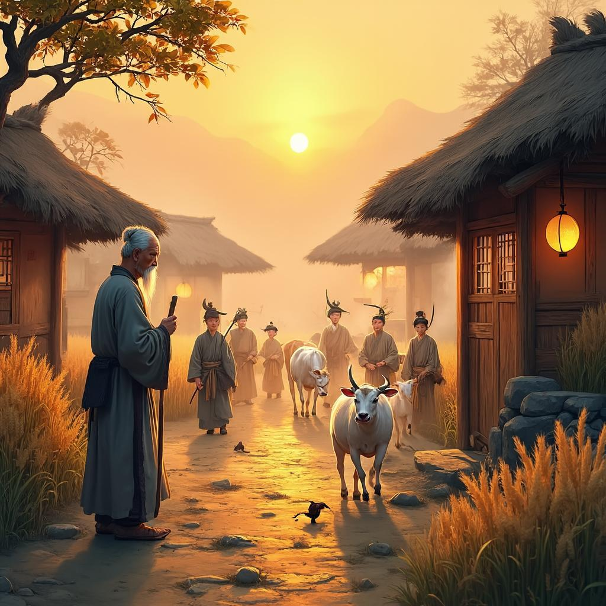

# 渭川田家
**作者**：王维 ｜ **朝代**：唐代

## 🎵 诗词朗读
<audio controls>
  <source src="./data/mp3/渭川田家_audio.mp3" type="audio/mpeg">
  您的浏览器不支持音频播放。
</audio>

📥 [下载音频文件](./data/mp3/渭川田家_audio.mp3)

## 🖼️ 诗意画境


🖼️ [查看原图](./data/images/渭川田家_王维.jpg)

---
## 📜 原文
```
斜阳照墟落，穷巷牛羊归。
野老念牧童，倚杖候荆扉。
雉雊麦苗秀，蚕眠桑叶稀。
田夫荷锄至，相见语依依。
即此羡闲逸，怅然吟式微。
```
## 🎯 主题
《渭川田家》主要描绘了农村傍晚的宁静景象，展现了田园生活的和谐与自然。诗人通过夕阳、归来的牛羊、等候的老人、鸣叫的野鸡、归家的农夫等画面，勾勒出一幅生动的农村生活图景。诗中流露出对这种简朴、闲适生活的羡慕之情，同时也表达了诗人内心的惆怅与矛盾，反映了他对官场生活的厌倦和对归隐田园的向往。整首诗体现了王维"诗中有画"的艺术特色，以及他追求心灵宁静、向往自然的人生理想。
## 🏗️ 结构
《渭川田家》是王维田园诗的代表作，其结构特点体现了诗人精心的艺术构思。从整体章法布局来看，这首诗采用了由景到人、由外到内、由客观到主观的递进式结构，层次分明，逻辑严谨。

全诗可分为三个部分：

第一部分为开篇两句："斜阳照墟落，穷巷牛羊归。"这部分以自然景象开篇，描绘了农村傍晚的宁静画面。斜阳、墟落、穷巷、牛羊等意象构成了一幅黄昏归牧图，为全诗奠定了恬淡闲适的基调，同时也暗示了"归"的主题。

第二部分为中间六句："野老念牧童，倚杖候荆扉。雉雊麦苗秀，蚕眠桑叶稀。田夫荷锄至，相见语依依。"这部分是全诗的主体，可细分为三个层次：
首先，"野老念牧童，倚杖候荆扉"描绘了农村中的人物活动，展现了老人与牧童之间的亲情；
其次，"雉雊麦苗秀，蚕眠桑叶稀"转向农村的自然景象和农业生产，表现了农村的生机与活力；
最后，"田夫荷锄至，相见语依依"再次回到人物活动，描绘了农民劳作归来的和谐场景。

第三部分为结尾两句："即此羡闲逸，怅然吟式微。"这部分由客观描写转向主观抒情，表达了诗人对田园生活的向往和对官场生活的厌倦。"式微"一词出自《诗经》，意为衰微，这里寄托了诗人对归隐的渴望。

从层次安排来看，全诗呈现出"景—人—情"的递进关系，先描绘自然景象，再展现人物活动，最后抒发内心感受，形成了一个完整的艺术整体。这种结构安排使得全诗意境深远，艺术感染力强，充分体现了王维"诗中有画"的艺术特色。
## ✍️ 语言风格
王维的《渭川田家》体现了其作为山水田园诗派代表诗人的典型风格，语言上呈现出清新淡雅、自然朴实的特点。从用词来看，诗中选用的词语极为贴近农村生活实际，如"斜阳"、"墟落"、"牛羊"、"牧童"、"荆扉"、"麦苗"、"桑叶"、"田夫"、"荷锄"等，都是农村日常景象中的常见元素，没有华丽辞藻，却生动勾勒出田园生活的真实图景。这些用词精准凝练，如"穷巷"中的"穷"字既表示巷子深远，又暗示农村简朴；"雉雊"中的"雊"字形象描绘野鸡鸣叫；"倚杖候荆扉"中的"倚"和"候"两个动词，精准刻画老人动作和心态。

在修辞手法上，诗人运用了白描手法，直接描绘所见所闻，如"斜阳照墟落，穷巷牛羊归"，简单几笔却意境全出。诗中巧妙结合静态与动态描写，"斜阳照墟落"是静态，而"穷巷牛羊归"是动态；"倚杖候荆扉"相对静态，而"雉雊麦苗秀"中的野鸡鸣叫是动态，这种动静结合使画面更加生动。"蚕眠桑叶稀"一句运用拟人手法，将蚕的行为描述为"眠"，赋予蚕以人的特征。整首诗采用借景抒情的方式，通过描绘田园生活的宁静美好，表达诗人对这种生活的向往和羡慕。诗中还隐含对比手法，将农村生活的宁静闲逸与官场生活的繁忙复杂形成对比。

句式结构上，诗歌对仗工整，如"斜阳照墟落，穷巷牛羊归"、"野老念牧童，倚杖候荆扉"等，这种对仗不仅使诗歌节奏和谐，也增强了画面的对称美。全诗节奏舒缓，没有急促语调，符合田园生活的宁静氛围。每句五个字，结构紧凑而平衡，读来朗朗上口。诗歌层次分明，前六句描绘景象，后两句抒发情感，前六句中又可分为两组：前四句描写人物活动，后两句描写自然景象，结构清晰有序。

在意象营造方面，诗中运用了丰富的意象，如"斜阳"、"墟落"、"牛羊"、"牧童"、"荆扉"、"雉"、"麦苗"、"蚕"、"桑叶"、"田夫"、"锄"等，这些意象共同构成了一幅完整的田园生活画卷。所有意象和谐统一，共同营造出宁静、祥和、质朴的田园氛围。诗人选择的意象非常传神，能够准确传达农村生活特点，如"倚杖候荆扉"中的"倚杖"和"荆扉"，生动刻画出农村老人的形象和生活环境。

情感表达上，诗人的情感含蓄内敛，不是直接抒发，而是通过景物描写间接表达。"即此羡闲逸，怅然吟式微"中的"羡"和"怅然"，虽然是直接表达情感，但也是在前六句景物描写基础上自然引出的。诗人的情感真挚自然，没有做作之感，他对田园生活的羡慕和向往发自内心，这种情感通过具体景物描写得到充分体现。诗中的景物描写和情感表达完美融合，达到情景交融的艺术效果，每一处景物描写都暗含诗人情感，而诗人情感又通过景物描写得到具体化。

这首诗充分体现了王维诗歌"诗中有画"的艺术特色，通过简洁而精准的语言，成功营造出一幅宁静祥和的田园生活图景，并表达了自己对这种生活的向往之情，展现了盛唐时期文人追求闲适、自然的生活态度和审美情趣。
## 📚 文化札记
《渭川田家》是王维田园诗的代表作，其中蕴含丰富的文化背景和典故。以下是重要的文化元素注释：

渭川：指渭水流域，位于今陕西省中部，是黄河最大的支流。渭水流经关中平原，这一地区自古就是中国重要的农业区，在唐代更是京畿重地，政治、经济、文化中心。王维选择这一地点作为诗歌背景，既有地理真实性，也有文化象征意义。

墟落与穷巷：墟落指村落、村庄，穷巷指偏僻的小巷。这些词语反映了唐代农村的居住环境，展现了诗人对普通农家生活的关注和描绘。

野老与荆扉：野老指乡间老人，荆扉是用荆条编成的简陋门扉。这些意象共同勾勒出唐代农村老人的生活状态，体现了农家生活的朴素与简陋。

雉雊麦苗秀，蚕眠桑叶稀：这两句描绘了唐代农村的典型生产场景。"雉雊"指野鸡鸣叫，是农村常见的自然声音；"麦苗秀"表现了农耕活动；"蚕眠桑叶稀"则反映了唐代重要的蚕桑业。这些细节展现了唐代农牧结合、农桑并重的农业经济特点。

田夫荷锄至：田夫指农夫，荷锄是扛着锄头。这一形象生动描绘了唐代农民劳作归来的场景，反映了农耕社会的基本生活状态。

式微：这是《诗经·邶风》中的一篇诗题。原诗内容为"式微，式微，胡不归？微君之故，胡为乎中露！"表达了对国家衰败的忧虑和对归隐的渴望。王维引用这一典故，既表达了对时局的忧虑，也抒发了自己向往归隐田园的思想情感。这一典故的运用，使诗歌具有了更深的文化内涵和历史厚重感。

王维的隐逸思想：王维（701-761年），字摩诘，号摩诘居士，唐代著名诗人、画家，有"诗佛"之称。他早年积极入仕，后因安史之乱中被俘而被迫接受伪职，乱平后被贬官。晚年半官半隐，在蓝田辋川过着半隐居的生活。这首诗反映了他对官场的厌倦和对田园生活的向往，体现了他的隐逸思想。

唐代田园诗传统：田园诗源于东晋陶渊明，至唐代达到高峰。王维与孟浩然并称"王孟"，是唐代田园诗派的代表人物。他们的诗歌多描写自然风光和田园生活，风格清新淡远，意境优美。《渭川田家》正是这一传统的典范之作。

诗歌中的禅意：王维深受佛教禅宗思想影响，他的诗歌常表现出"物我两忘"、"天人合一"的哲学思想。这首诗中对自然和田园生活的描绘，也体现了这种思想，表达了人与自然和谐共处的理想境界。

通过这些文化元素的解读，我们可以更深入地理解《渭川田家》不仅仅是一幅优美的田园风景画，更是诗人对理想生活方式的追求和对时代现实的思考，体现了王维诗歌深厚的文化底蕴和独特的艺术风格。
## 🌅 创作背景
《渭川田家》创作于唐玄宗开元末年至天宝初年（约735-745年）之间，地点在渭水流域，即今陕西省关中平原一带。当时王维正值中年，经历了官场起伏后，选择在蓝田县辋川别业过半官半隐的生活。

王维此时的生活状况相对安定但心境复杂。他早年曾任右拾遗、监察御史等职，但在开元二十五年（737年）左右因政治挫折而疏离官场。这一时期，他既享受着田园生活的宁静，又无法完全摆脱对世事的责任感，内心处于一种向往与怅惘交织的状态。诗中"即此羡闲逸，怅然吟式微"正是这种矛盾心境的真实写照。

从历史背景看，这一时期是唐朝由盛转衰的关键阶段。唐玄宗前期开创的"开元盛世"已现疲态，朝政逐渐被李林甫等人把持，政治开始腐败。社会表面繁荣却暗藏危机，许多文人士大夫对朝政失望，纷纷选择隐居或半隐居的生活方式，追求精神上的自由与宁静。

王维创作此诗的动机主要源于对官场生活的厌倦和对田园生活的向往。在辋川别业隐居期间，他有充足机会近距离观察农村生活，积累了丰富的创作素材。同时，他深受佛教思想影响，追求心灵宁静与超脱，这种思想也渗透在对田园生活的描绘中。此外，中国传统文人的"归隐"情结也是激发他创作的重要因素。诗中描绘的夕阳、归牧、农人等意象，构成了一个和谐宁静的田园世界，寄托了诗人对理想生活的向往与追求。
## 💭 情感基调
《渭川田家》的情感基调和氛围特点可概括为：宁静祥和、朴实自然、和谐融洽、惆怅感伤、淡泊超逸。

诗中通过斜阳、归来的牛羊、等候的老人、茁壮的麦苗等意象，营造出一种平和安宁的乡村傍晚景象，展现了人与自然的和谐共处。诗人用朴素的语言描绘了农村生活的真实画面，表现了对朴实自然生活的赞美。诗中老人对牧童的牵挂、农夫相见时的亲切交谈，体现了乡村人际关系的温情与融洽。

然而，最后两句"即此羡闲逸，怅然吟式微"又流露出诗人的感伤情绪，他羡慕这种闲适生活，却又带着一种失落和无奈，暗示了诗人对这种淳朴生活方式可能消逝的忧虑。整首诗在淡泊中见真情，在宁静中藏感伤，体现了王维诗歌特有的禅意和超脱。
## 🔍 赏析
《渭川田家》是王维田园诗的代表作，充分体现了其"诗中有画"的艺术特色。在意境营造上，诗人以白描手法勾勒出一幅宁静和谐的乡村黄昏图景，从"斜阳照墟落"的远景到"倚杖候荆扉"的近景，空间层次分明，动静结合。牛羊归圈、野老候童、雉鸡鸣叫、农夫归来等生活场景的有机组合，构建了一个充满生机的田园世界，展现了诗人对自然与生活的细腻观察。

语言特色方面，王维以简洁凝练的笔触，仅用四十字便完整呈现乡村生活图景。"雉雊麦苗秀，蚕眠桑叶稀"运用对偶手法，既增强了节奏感，又丰富了画面内容。诗中多处细节描写如"倚杖"、"荷锄"等，虽小却起到画龙点睛之效，使人物形象更加鲜活。同时，诗人巧妙运用象征手法，"斜阳"不仅指时间，也象征一天劳作的结束和生活的安宁。

情感表达上，前八句客观描绘农村傍晚景象，最后两句"即此羡闲逸，怅然吟式微"直抒胸臆，表达了诗人对田园生活的向往和对官场生活的厌倦。诗中展现的农村淳朴生活与真挚情感，与官场的尔虞我诈形成鲜明对比，体现了诗人淡泊名利、追求内心宁静的人生态度。

从文学价值看，这首诗完美展现了中国古典诗歌"意境"的审美特征，对后世山水田园诗创作产生深远影响。它不仅是对农村生活的描绘，更是中国传统文化中"归隐"思想的体现，反映了古代文人在仕途与隐逸之间的矛盾心理。同时，作为研究唐代农村生活的珍贵文献，它为我们了解当时社会的生产方式、生活状态提供了重要窗口，具有不可替代的历史价值和文化意义。
## 📖 相关作品
归园田居·其一 陶渊明，过故人庄 孟浩然，乡村四月 翁卷
## 🏷️ 标签
山水田园诗,盛唐诗歌,田园生活,自然景物,农村风情,归隐情怀,羡慕,怅惘,宁静,思乡,白描,情景交融,意境优美,五言律诗,王维代表作,渭川风物
