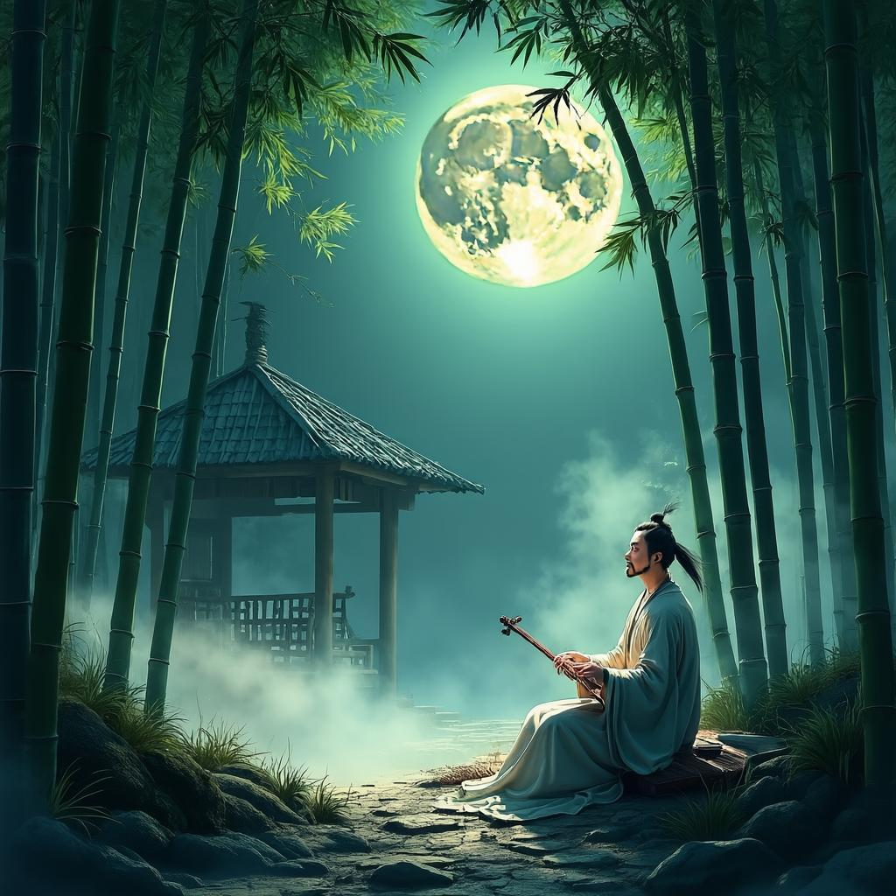

# 竹里馆
**作者**：王维 ｜ **朝代**：唐代

## 🎵 诗词朗读
<audio controls>
  <source src="./data/mp3/竹里馆_audio.mp3" type="audio/mpeg">
  您的浏览器不支持音频播放。
</audio>

📥 [下载音频文件](./data/mp3/竹里馆_audio.mp3)

## 🖼️ 诗意画境


🖼️ [查看原图](./data/images/竹里馆_王维.jpg)

---
## 📜 原文
```
独坐幽篁里，弹琴复长啸。
深林人不知，明月来相照。
```
## 🎯 主题
王维的《竹里馆》主要表达了隐逸超脱、与自然和谐共处的主题思想。诗中描绘了诗人独自在幽深竹林中弹琴长啸，虽无人知晓，却有明月相伴的情景。这展现了诗人远离尘世喧嚣、追求心灵宁静的生活态度，以及在孤独中自得其乐的精神境界。整首诗流露出一种淡泊名利、超然物外的心境，体现了王维深受禅宗思想影响的"物我两忘"境界，表达了对自然与内心和谐统一的向往。
## 🏗️ 结构
《竹里馆》作为王维山水田园诗的代表作，其结构特点体现了精妙的章法布局和层次安排。全诗虽仅四句，却构建了一个完整而深邃的艺术世界。

从章法布局看，这首绝句采用了"景-情-理"的三段式结构。首句"独坐幽篁里"设定场景，描绘环境；次句"弹琴复长啸"展现人物活动与情感；后两句"深林人不知，明月来相照"则升华至哲理层面，表达人与自然的关系。这种布局使诗歌由具体到抽象，由表象到本质，层次分明而又浑然一体。

在层次安排上，诗歌呈现出明显的递进关系。第一层是空间定位，"幽篁"勾勒出具体环境；第二层是人物活动，"弹琴复长啸"表现诗人的行为与心境；第三层是空间拓展，"深林"将视野从竹林扩大到整个森林；第四层是意境升华，"明月"作为自然之美的象征，成为诗人的精神伴侣。这种层层推进的结构，使诗歌意境不断深化。

结构上还体现了由近及远、由实到虚、由动到静的艺术特点。从"幽篁"到"深林"，空间逐渐扩大；从"坐"、"弹"、"啸"等具体动作到"人不知"、"明月照"的意境营造，实现了由实到虚的转变；前两句动态描写与后两句静态呈现形成对比，增强了艺术表现力。

在意象安排上，"幽篁"、"琴"、"深林"、"明月"等意象层层递进，共同构建了超然物外的隐逸氛围。特别是结尾的"明月"意象，不仅照亮了深林，也照亮了整首诗的意境，起到了画龙点睛的作用，体现了王维"诗中有画"的艺术特色。

这首诗的结构安排既符合绝句的体裁特点，又充分展现了王维诗歌的艺术魅力，通过精心的章法布局和层次安排，成功营造了一种清幽静谧、超然物外的隐逸意境，表达了诗人与自然和谐共处的哲理思考。
## ✍️ 语言风格
王维的《竹里馆》体现了其"诗中有画"的艺术特色，语言风格清新淡雅，意境深远。从用词上看，全诗仅二十字，却勾勒出一幅完整的隐居画面，用词简洁凝练而不失韵味。"独坐"、"弹琴"、"长啸"等词语平实自然，不事雕琢，却准确传达出诗人的隐逸情怀。诗中选取"幽篁"、"深林"、"明月"等典型意象，营造出清幽寂静的氛围，动静结合，形成独特的艺术效果。

在修辞手法上，诗人运用白描手法，以简练的笔触勾勒画面，不加修饰却意境深远。通过"幽篁"、"深林"等意象营造出幽静、深远的意境，以"深林人不知"衬托出诗人的隐逸情怀，以"明月来相照"暗示诗人与自然的和谐共处。特别值得注意的是末句"明月来相照"中的拟人手法，赋予明月以人的情感，表现出自然与诗人的亲密关系。

这首诗的语言风格清新淡雅，不事华丽却自有一种韵味，体现了王维诗歌"淡而有味"的艺术特色。诗人不直接抒发情感，而是通过景物描写间接表达心境，情感含蓄而深沉。诗中透露出一种超然物外、与自然合一的禅意，反映了王维深受佛教影响的思想。结构上前两句写人，后两句写景，人景交融，表现出诗人与自然的和谐共处。音律和谐，节奏鲜明，读来朗朗上口，给人以美的享受。

总体而言，《竹里馆》以其简洁凝练的语言、清新淡雅的风格和含蓄蕴藉的情感，成为中国古典诗歌中的经典之作，充分展现了王维作为"诗佛"的艺术成就。
## 📚 文化札记
《竹里馆》是王维在辋川别业中的一处建筑，位于今陕西省蓝田县辋川。辋川别业是王维晚年隐居的地方，他在这里建有多处亭台楼馆，竹里馆是其中之一，建在竹林深处，环境幽静，是王维修身养性、弹琴作诗的理想场所。

"幽篁"指幽深的竹林。在中国传统文化中，竹子象征着高洁、坚韧的品格。竹子四季常青，中空有节，被视为君子品格的象征。王维喜爱竹子，常以竹入诗，表达自己的精神追求。

诗中的"琴"指的是古琴，中国传统乐器之一，被誉为"圣人之器"。古琴在古代文人生活中占有重要地位，被视为修身养性、抒发情感的工具。王维精通音律，擅长弹琴，弹琴是他隐居生活的重要组成部分。

"长啸"在古代文人的语境中，不仅指大声呼喊，更是一种抒发情怀、表达超脱世俗的方式。魏晋时期的文人如阮籍、嵇康等就有"长啸"的传统，被视为名士风度的一种表现。王维的"长啸"体现了他对魏晋名士风度的继承和向往。

"深林"指茂密的树林，象征着远离尘嚣的隐居环境。在中国传统文化中，山林是隐士的理想居所，代表着与自然的和谐共处和对世俗的超脱。王维作为山水田园诗的代表诗人，对山林有着特殊的情感。

明月在中国古典诗词中是一个常见的意象，象征着高洁、清明的品格和永恒的美。在王维的诗中，明月常常作为诗人的知己出现，与诗人进行精神上的交流。这里的"明月来相照"暗示了诗人与自然的和谐关系，以及他在独处中并不感到孤独的心境。

王维（701-761），字摩诘，号摩诘居士，是唐代著名的诗人、画家和音乐家，有"诗佛"之称。他早年曾入仕，但在经历了安史之乱后，逐渐转向佛教，选择了半官半隐的生活方式。他的诗歌深受禅宗思想影响，追求内心的宁静和对自然的感悟。《竹里馆》正是他隐居生活的写照，展现了他超然物外、与自然合一的精神境界。

这首诗还体现了禅宗思想的影响。王维晚年笃信佛教，尤其是禅宗。诗中体现的独处、宁静、与自然合一的境界，正是禅宗思想的体现。禅宗强调"明心见性"，追求内心的觉悟和宁静。诗中的"独坐"、"弹琴"、"长啸"等活动，都是诗人修行的方式，而"明月来相照"则象征着顿悟的瞬间。

此外，王维不仅是诗人，也是画家，被誉为"文人画"的鼻祖。他的诗被称为"诗中有画"，画被称为"画中有诗"。《竹里馆》这首诗通过简洁的语言，勾勒出一幅幽静的竹林月夜图，体现了王维诗画合一的艺术特色。

这首诗还与魏晋风度有着联系。王维的诗歌和生活方式在某种程度上继承了魏晋时期名士的风度。魏晋名士如阮籍、嵇康等，崇尚自然，追求个性解放，常以隐居山林、弹琴长啸来表达对世俗的超脱。王维在《竹里馆》中展现的隐居生活和艺术追求，与魏晋名士有着精神上的联系。
## 🌅 创作背景
《竹里馆》创作于唐玄宗开元末年至天宝初年（约735-745年）之间，地点在王维位于今陕西省蓝田县的辋川别业中的一处景点"竹里馆"，这是王维在竹林中建造的休憩之所。

当时王维已步入中年，曾历任右拾遗、监察御史等职，但因官场沉浮，逐渐对仕途产生厌倦。开元二十五年（737年）左右，他被贬为济州司仓参军，不久后辞官归隐辋川，过着半官半隐的生活。此时的王维心境恬淡闲适，已摆脱了功名利禄的束缚，追求内心的宁静与超脱，沉浸在山水自然之中，寻求精神的自由。

从历史背景看，这一时期虽属盛唐，社会繁荣稳定，但朝廷政治已开始出现变化，李林甫等人逐渐专权，朝政趋于腐败。同时，佛教特别是禅宗思想在文人中广泛传播，深刻影响着士人的精神世界。王维作为虔诚的佛教徒，其思想和创作深受禅宗影响，追求"物我两忘"的境界。

这首诗的创作动机源于王维对隐逸生活的热爱和对自然的亲近。竹林在中国传统文化中象征高洁、坚韧和隐逸，王维选择在竹林中建造小屋，正是为了表达自己追求高洁品格的愿望。诗中描绘的独坐、弹琴、长啸等场景，都是他日常生活的真实写照，反映了他与自然和谐共处的理想生活状态。明月的意象则象征着纯净和永恒，与诗人追求的精神境界相呼应，体现了王维"诗中有画"的艺术特色和禅宗"空寂"的美学追求。
## 💭 情感基调
《竹里馆》的情感基调可概括为"孤而不寂，恬淡自得"。诗人独坐竹林，虽处孤独之境，却通过弹琴长啸展现内心的自在与满足，体现出一种超然物外的隐逸情怀。

氛围特点可概括为"幽静空灵，清冷高远"。诗中幽深的竹林、寂静的环境营造出清幽的氛围，而明月的映照又增添了几分空灵之感。整首诗呈现出一种远离尘嚣、与自然和谐共处的意境，既有孤独的清冷，又有与明月相伴的温馨，形成了一种独特的高远意境。
## 🔍 赏析
王维的《竹里馆》以其简练的笔触勾勒出一幅幽静空灵的隐士生活图景。在意境营造上，诗人巧妙地运用"幽篁"、"深林"等意象，构建了一个与世隔绝的清幽空间，而"明月来相照"则为这幅画面增添了清冷的光辉，使整个意境更加空灵深远。诗人采用动静结合的艺术手法，"独坐"为静，"弹琴复长啸"为动，形成鲜明对比，既表现了环境的幽静，又展现了诗人内心的丰富活动。

语言特色方面，这首诗简洁凝练，仅用二十字便勾勒出完整的意境。王维善用白描手法，不加修饰地呈现自然景物，如"幽篁"、"深林"、"明月"等，都是直接而精准的描绘。诗中"复"字用得尤为巧妙，表现了诗人在幽静中的自得其乐；"人不知"与"明月来相照"形成对比，突显了诗人虽孤独却不寂寞的心境。

情感表达上，这首诗深刻体现了王维超然物外、与自然合一的隐逸情怀。诗人远离尘嚣，不为人知，却并不感到孤独，因为大自然成为他的知己。这反映了王维受佛教思想影响，追求心灵宁静、超脱世俗的人生哲学，也体现了他"诗中有画，画中有诗"的艺术特色。

《竹里馆》作为王维山水诗的代表作，展现了中国古典诗歌中"情景交融"的艺术特色，对后世影响深远。它不仅体现了唐代文人的隐逸情怀，也展现了中国传统文化中"天人合一"的哲学思想。王维将诗、画、音乐、禅理融为一体，开创了诗歌艺术的新境界，这首短小精悍而意境深远的作品，成为中国古典诗歌中的珍品，也是世界文学宝库中的瑰宝。
## 📖 相关作品
山居秋暝 王维，鹿柴 王维，饮酒·其五 陶渊明
## 🏷️ 标签
山水田园诗派,唐诗,禅意诗,隐逸生活,自然景物,孤独与超脱,音乐与艺术,恬淡,超然物外,宁静祥和,孤独但不寂寞,意境优美,融情于景,语言清新,禅意深远
