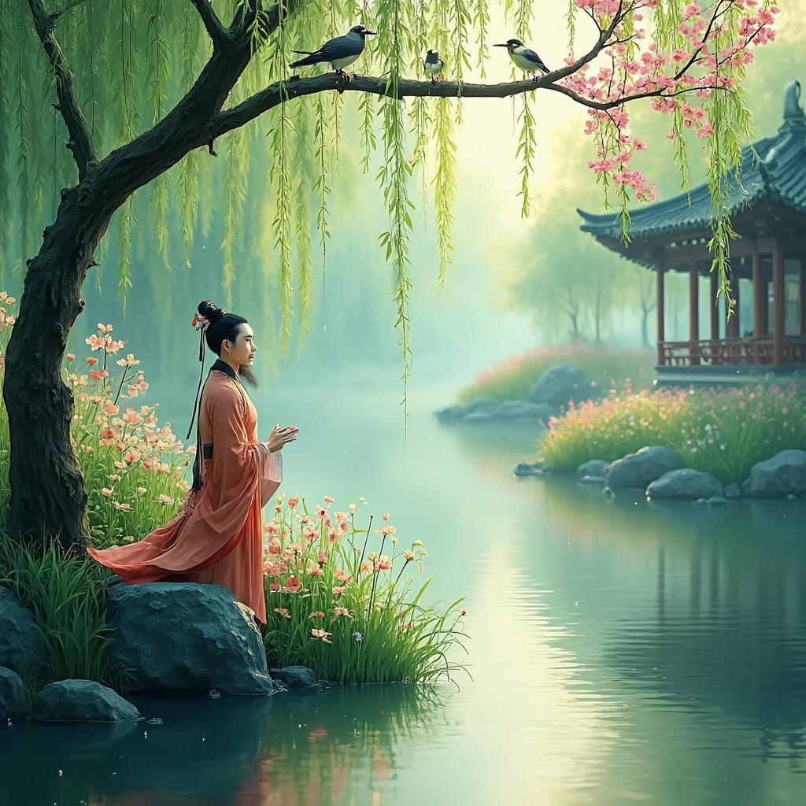

# 西斋书事
**作者**：王安石 ｜ **朝代**：宋代

## 🎵 诗词朗读
<audio controls>
  <source src="./data/mp3/西斋书事_audio.mp3" type="audio/mpeg">
  您的浏览器不支持音频播放。
</audio>

📥 [下载音频文件](./data/mp3/西斋书事_audio.mp3)

## 🖼️ 诗意画境


🖼️ [查看原图](./data/images/西斋书事_王安石.jpg)

---
## 📜 原文
```
幽花露草争春，弱柳轻风拂水。
鸟语花香自适，心闲境静无尘。
```
## 🎯 主题
《西斋书事》以简练的笔触描绘了春日西斋周围的幽静景象，表达了王安石对闲适淡泊生活的向往。诗中通过"幽花露草"、"弱柳轻风"、"鸟语花香"等自然意象，营造出一个宁静和谐的环境，进而引出"心闲境静无尘"的精神境界。全诗主题思想可概括为诗人追求物我合一、超脱世俗的生活态度，展现了一种将内心与自然相融合、远离尘世纷扰的理想人生状态。这首诗反映了王安石在政治生涯之外，对心灵宁静和精神自由的深切向往。
## 🏗️ 结构
《西斋书事》是王安石的一首五言绝句，其结构特点主要体现在章法布局和层次安排上。这首诗采用了"由景入情"的章法布局，前两句写景，后两句抒情，形成"景-情"的结构模式。

在层次安排上，诗歌呈现出"外-内"的递进关系。第一层次是外景描写，"幽花露草争春，弱柳轻风拂水"描绘了春天的自然景物，包括幽花、露草、弱柳、轻风和水等元素，构成了一幅生机盎然的春景图。第二层次则转入内境，"鸟语花香自适，心闲境静无尘"表达了诗人由外景引发的内心感受和精神境界。

从对仗结构看，这首诗也颇具特色。"幽花露草"与"弱柳轻风"形成对仗，都是自然景物的组合；"争春"与"拂水"形成对仗，都是动态描写；"鸟语花香"与"心闲境静"形成对仗，前者是外在感受，后者是内在状态。这种对仗结构使诗歌在形式上更加整齐，读来节奏鲜明。

在描写手法上，诗歌巧妙地结合了动态和静态的描写。"争春"、"拂水"、"鸟语"等动态描写表现了春天的生机，而"幽花"、"露草"、"弱柳"等静态描写则呈现了春天的静谧与柔美。这种动静结合的描写手法，使诗歌画面更加丰富多变。

从空间结构来看，这首诗呈现出由近及远、由实到虚的展开方式。近景是"幽花露草"、"弱柳"等近距离景物，中景是"轻风拂水"，而"鸟语花香"、"心闲境静无尘"则已超越了具体空间限制，进入了一种精神境界。

在情感表达上，诗歌呈现出递进关系，从观赏自然景物的愉悦之情，到感受"鸟语花香"带来的舒适感，最后达到"心闲境静无尘"的超然境界，展现了诗人由外物触发到内心升华的过程。

这些结构特点共同作用，使这首短小的五言绝句在艺术上达到了很高的成就，展现了王安石深厚的文学功力。
## ✍️ 语言风格
《西斋书事》是王安石的一首描写春日景色与心境的短诗，全诗语言清新淡雅，意境优美，体现了王安石诗歌中独特的艺术风格。

在用词方面，诗人选用了"幽花"、"露草"、"弱柳"、"轻风"等词语，这些词汇都带有轻柔、雅致的色彩，营造出一种宁静、清幽的氛围。"幽"字表现了花的静谧，"露"字点明了清晨的时分，"弱"字描绘出柳枝的轻盈柔美，"轻"字则表现出风的柔和。这些词语精准而富有表现力，寥寥数笔便勾勒出一幅生动的春日图景。

在修辞手法上，诗人运用了多种技巧。首先是拟人手法，如"争春"一词，将花草人格化，赋予它们争抢春天的行为，使画面更加生动形象。其次是对偶，"幽花露草"与"弱柳轻风"、"鸟语花香"与"心闲境静"形成工整的对偶，结构整齐，节奏和谐。此外，诗人还运用了通感手法，通过"鸟语"（听觉）和"花香"（嗅觉）的结合，调动读者的多种感官体验，使诗歌更加立体丰富。

在意象构建上，诗人巧妙地组合了"幽花"、"露草"、"弱柳"、"轻风"、"水"等自然意象，构成一幅清新淡雅的春日画面。这些意象不仅描绘了外在的自然景色，更折射出诗人内心的闲适与宁静。特别是"无尘"一词，既指环境的洁净，更象征诗人超脱世俗、清净无扰的精神境界。

整体而言，这首诗语言凝练含蓄，意境深远，情景交融。王安石以简洁的笔触，将自然景物与个人心境融为一体，表现出物我两忘的境界。这种清新自然、含蓄内敛的语言风格，既体现了王安石作为政治家在繁忙之余追求心灵宁静的精神追求，也展示了他作为文学家的深厚艺术造诣。
## 📚 文化札记
《西斋书事》是北宋著名政治家、文学家王安石创作的一首描绘春日闲适景象的小诗。以下是对诗中文化元素的注释：

西斋：诗题中的"西斋"指王安石的书房或居所。在宋代文人的居所中，书房往往有特定的雅称，"斋"是文人对书房的尊称。根据王安石生平，此西斋很可能位于他晚年退居的江宁（今南京）住所。王安石在政治上失意后，退居江宁半山园，潜心著述，此诗可能创作于这一时期。

幽花露草：描绘春天不张扬的花朵与带着晨露的青草。这种细腻的自然描写体现了宋代文人对自然景观的敏锐观察和审美情趣，也反映了王安石晚年退隐后对自然生活的亲近。

弱柳轻风：柳树在古典诗词中常作为春天的象征，"弱柳"指柔软婀娜的柳枝，"轻风"则是和煦的春风。这一意象组合在中国文学传统中极为常见，象征着春天的生机与柔美，也暗含着诗人对生命力的感悟。

鸟语花香：形容春天鸟儿鸣叫、花儿散发香气的美好景象。这一表达在后世成为常用成语，但在王安石时代可能是较为新颖的组合，体现了诗人对感官体验的细腻捕捉。

心闲境静无尘：此句反映了诗人的精神境界。"无尘"既指实际环境的洁净，更有超脱世俗、心境清净的象征意义。这与王安石晚年受佛教思想影响有关。王安石在变法失败后退隐，潜心研究佛学，诗中的"无尘"境界与佛教中的"清净"概念相呼应，体现了他从政治斗争转向内心平静的人生转变。

整体而言，这首诗虽短小，但通过自然景物的描绘，折射出王安石晚年退隐后的心态变化，从政治上的雄心壮志转向对自然与内心宁静的追求，是了解王安石晚年思想的重要作品。
## 🌅 创作背景
《西斋书事》创作于北宋神宗熙宁末年至元丰年间（约1076-1086年），地点为王安石在江宁（今南京）的居所西斋。这一时期，王安石已两次罢相，彻底退出了政治舞台，在钟山脚下建半山园隐居。此时的王安石已年过五旬，远离了朝堂纷争，过着相对平静的生活，将主要精力投入学术研究和文学创作。

从诗中"心闲境静无尘"的表述可以看出，王安石此时的心境已从早年锐意改革、积极进取转变为平和闲适。这种心态转变与他退隐后的生活状态密切相关。在江宁的十年间，他潜心著述，完成了《字说》、《三经新义》等重要著作，同时也有更多时间欣赏自然、思考人生。

历史背景方面，王安石退隐标志着熙宁变法的实质性结束。虽然宋神宗仍继续推行部分新法，但力度已大不如前。当时的北宋社会面临土地兼并严重、农民负担沉重、社会矛盾尖锐等问题，同时北方辽国和西北西夏的威胁依然存在。在这样的政治和社会环境下，王安石选择退隐，既是对政治现实的妥协，也是对个人生活道路的重新选择。

《西斋书事》的创作动机源于王安石对闲适生活的热爱和对自然的深刻感悟。诗中"幽花露草争春，弱柳轻风拂水。鸟语花香自适"等句，直接描绘了西斋周围春天的自然景象，表现了作者对自然美的敏锐观察和深厚感情。这首诗不仅反映了王安石退隐后的生活状态和心境变化，也展示了他作为"唐宋八大家"之一的文学才华和对自然美的独特感悟。
## 💭 情感基调
《西斋书事》的情感基调以闲适恬淡为主，诗人通过对春日景物的细腻描绘，展现出一种超然物外的宁静心境。诗中"幽花露草"、"弱柳轻风"等意象营造出清新自然的氛围，而"心闲境静无尘"则直接点明了诗人内心的平和与清净。整体氛围特点可概括为清新幽静、恬淡自然，透露出诗人远离尘世喧嚣、安于闲适生活的态度。诗作语言简洁却意境深远，体现了王安石晚年归隐后的生活情趣和精神追求。
## 🔍 赏析
《西斋书事》是王安石的一首短小精悍之作，虽仅四句，却意境深远，艺术精湛。从意境营造看，诗人通过"幽花露草"、"弱柳轻风"、"鸟语花香"等意象，勾勒出一个远离尘嚣、宁静祥和的书斋环境。"争春"二字运用拟人手法，赋予花草生命力；"拂水"则以动态描摹展现春日轻盈。全诗由外而内，从景物到心境，层次分明，结构严谨。

语言特色上，此诗简洁明快，无华丽辞藻却意境深远。每句七字，整齐和谐。"幽花露草"与"弱柳轻风"形成对仗，"鸟语花香"与"心闲境静"遥相呼应。"争"字表现春天生机，"拂"字传达微风细腻，"自适"一词则点出人与自然和谐状态。用词精准，无一赘字，体现宋诗"以少胜多"的特点。

情感表达方面，诗人流露出对闲适生活的向往和对自然的热爱。"心闲境静无尘"直接点明其闲适、宁静、超脱世俗的心境。此诗体现了中国传统文人"天人合一"的哲学思想，尤其对王安石这样一位致力于政治改革的人来说，更显得珍贵，可视为他在政治风波中对内心宁静的向往与寄托。

文学价值上，这首诗集中体现了宋代诗歌"平淡自然"的审美特点，展现了王安石作为文学大家的才华。它将写景与抒情完美结合，达到情景交融的艺术境界，代表了宋代文人诗追求平淡自然、含蓄内敛的风格，对后世产生深远影响。同时，它也延续了中国文学中从陶渊明到王维的"隐逸"主题传统，构成中国文学中重要的精神追求线索。
## 📖 相关作品
山居秋暝 王维，饮酒·其五 陶渊明，鸟鸣涧 王维
## 🏷️ 标签
宋代文学,文人诗,山水诗,写景诗,写景抒情,自然描写,闲适生活,春景,隐逸,闲适,恬淡,宁静,超脱,愉悦,对仗工整,意境优美,语言凝练,王安石晚年诗作,儒家思想,道家思想
