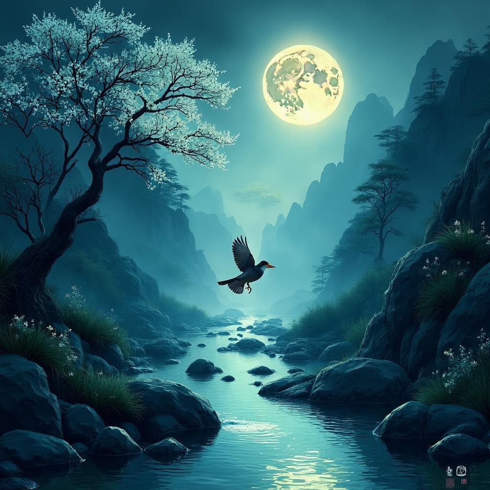

# 鸟鸣涧
**作者**：王维 ｜ **朝代**：唐代

## 🎵 诗词朗读
<audio controls>
  <source src="./data/mp3/鸟鸣涧_audio.mp3" type="audio/mpeg">
  您的浏览器不支持音频播放。
</audio>

📥 [下载音频文件](./data/mp3/鸟鸣涧_audio.mp3)

## 🖼️ 诗意画境


🖼️ [查看原图](./data/images/鸟鸣涧_王维.jpg)

---
## 📜 原文
```
人闲桂花落，夜静春山空。
月出惊山鸟，时鸣春涧中。
```
## 🎯 主题
《鸟鸣涧》主要表现了诗人对自然和谐之美的感悟与赞美。通过描绘春山夜景中桂花飘落、月出惊鸟、鸟鸣涧中的景象，营造了一种静谧中蕴含生机的意境。诗中"人闲"二字点出诗人闲适淡泊的心境，与自然融为一体；"夜静"与"空"则渲染出山林的幽静空灵，而鸟儿的鸣叫又为这宁静增添了一抹生动。全诗体现了王维"诗中有画"的艺术特色，以及"天人合一"的哲学思想，同时也流露出诗人受禅宗影响的超然物外的心境，展现了中国古典美学中"静中有动"的审美理想。
## 🏗️ 结构
《鸟鸣涧》作为王维的代表作之一，其结构特点体现了诗人高超的艺术构思和精妙的布局技巧。从章法布局来看，这首五言绝句遵循了严格的起承转合结构：首句"人闲桂花落"为起，点明人物状态与环境背景；次句"夜静春山空"为承，进一步渲染环境的静谧氛围；第三句"月出惊山鸟"为转，引入新的动态元素，形成转折；末句"时鸣春涧中"为合，回应前文的静谧与动态对比，达到和谐统一。

在层次安排上，这首诗呈现出多重层次。空间层次上，由近及远再由远及近：从近处的"人闲桂花落"，扩展到远处的"春山空"，再回到山中的"惊山鸟"，最后聚焦于涧中的鸟鸣，形成空间上的回环往复。动静层次上，前两句以静态描写为主，营造极度宁静的氛围；后两句则引入动态元素，在静中见动，形成动静结合的艺术效果。这种动静相生的表现手法，既展现了春山的宁静，又通过鸟鸣增添了生机。

时间流动方面，诗中呈现出明显的时间推移：从"人闲桂花落"的傍晚时分，到"夜静春山空"的夜晚，再到"月出惊山鸟"的深夜，最后到"时鸣春涧中"的更深夜晚，通过时间的自然流动，展现了一个完整的春山夜景。

在意象安排上，诗人精心选择了桂花、春山、月、山鸟、春涧等自然意象，与闲、静、空、惊、鸣等状态意象相互映衬，共同构建出一幅立体丰富的春山夜色图。这些意象的排列既有逻辑性，又有美感，体现了王维"诗中有画"的艺术特色。

情感层次上，从"人闲"的闲适心境，到"夜静春山空"的自然融入，再到"月出惊山鸟"的一丝惊喜，最后到"时鸣春涧中"的和谐陶醉，情感由平静到惊喜，再到和谐，形成完整的情感体验过程。

此外，诗中多处运用对比与呼应手法：动静对比、远近呼应、感官呼应等，使得短短二十字的诗歌内涵丰富，层次分明。整首诗呈现出"静-动-静"的结构特点，既有变化又有统一，充分展现了王维山水诗的艺术魅力。
## ✍️ 语言风格
王维的《鸟鸣涧》体现了典型的山水田园诗风格，其语言特点可从以下几个方面分析：

在用词上，这首诗极为凝练，全诗仅二十字，却意境深远。诗人选词清淡自然，如"闲"、"静"、"空"等字眼，营造出一种超然物外的氛围。同时，诗中的意象选择极为精准，"桂花"、"春山"、"月"、"山鸟"、"春涧"等自然意象，共同构成了一幅清幽的山林夜景图。动词的运用尤为精妙，"落"、"惊"、"鸣"等动态词汇，使静态的画面产生了生动的动态感，形成了动静结合的艺术效果。

在修辞手法方面，对比手法贯穿全诗。"人闲"与"夜静"形成环境氛围的对比；"桂花落"的细微动态与"春山空"的静态形成视觉对比。诗人还运用拟人手法，将"月出"描述为能"惊山鸟"，赋予自然景物以人的情感和行为。更为精妙的是衬托手法的运用，以"时鸣春涧中"的鸟鸣声，反而更衬托出山涧的幽静，体现了"以动衬静"的艺术效果。

语言风格上，这首诗清新淡雅，不事雕琢，如清水芙蓉，不着痕迹。同时，诗歌含蓄隽永，言简意赅，给读者留下广阔的想象空间。诗中透露出一种超然物外、与自然和谐共处的禅宗思想，体现了王维"诗佛"的特色。语言具有强烈的画面感，读诗如观画，展现了王维"诗中有画"的艺术特点。

句法结构上，前两句"人闲桂花落，夜静春山空"形成因果关系，因为人闲，所以能感知桂花飘落；因为夜静，所以春山显得空旷。后两句"月出惊山鸟，时鸣春涧中"也是因果相承，月亮出现惊动了山鸟，山鸟不时在春涧中鸣叫。整首诗结构紧凑，前后呼应，形成一个完整的意境。

音韵方面，作为一首五言绝句，格律工整，"落"、"空"、"中"押韵，读来朗朗上口。音调抑扬顿挫，与诗中表达的静谧氛围相得益彰。

综合来看，《鸟鸣涧》通过动静结合、虚实相生的艺术手法，营造出一种空灵幽远的意境，展现了王维对自然的细腻观察和深刻感悟，是盛唐山水诗的典范之作。
## 📚 文化札记
《鸟鸣涧》是唐代诗人王维的代表作之一，体现了王维"诗中有画"的艺术特色和禅宗思想影响下的自然观照。以下是这首诗的重要文化背景注释：

关于作者王维：王维（701年－761年），字摩诘，号摩诘居士，官至尚书右丞，世称王右丞。他是盛唐时期著名的诗人、画家、音乐家，因笃信佛教，尤其精通禅宗，被后人尊称为"诗佛"。王维的诗歌以山水田园题材为主，风格清新淡远，意境空灵，与孟浩然并称"王孟"，是唐代山水田园诗派的代表人物。

诗中"桂花"的文化内涵：桂花在中国传统文化中象征高洁、吉祥和美好。虽然桂花通常在秋季开花，但诗中提到的可能是春季开花的四季桂，或是诗人为了艺术效果进行的处理。桂花常与月亮联系在一起，有"桂月"之说，在中国古典诗词中是常见的意象，代表着清雅脱俗的品格。

"春山"的意象：在唐诗中，春山是表现生机勃勃自然景象的重要意象。王维的山水诗中经常出现山景描写，体现了他对自然的细致观察和深刻感悟。"春山空"中的"空"字，既有景物空旷之意，也暗含佛教"空"的哲理，体现了王维诗歌中常见的禅宗思想。

"月出惊山鸟"的意境：月亮在中国传统文化中具有丰富的象征意义，常与思乡、团圆、静谧等情感联系在一起。这一描写既表现了月光的明亮，也表现了山林的静谧，以及鸟儿对光线变化的敏感反应，形成了一幅动静结合的画面，体现了王维对自然细微变化的敏锐观察力。

"春涧"的文化意义：涧指山间的小溪流，是山水诗中常见的意象。在王维的诗中，涧水常与山景、鸟鸣等元素结合，构成完整的自然画卷。涧水流动的声音与鸟鸣声相互呼应，增添了诗的音韵美，也体现了王维诗歌"有声画"的艺术特色。

创作背景：这首诗可能创作于王维隐居终南山或辋川别业期间。王维一生曾多次隐居，尤其是在安史之乱后，他更加倾向于佛教修行和隐居生活。这首诗反映了他在隐居生活中的闲适心态和对自然的细致观察。

禅宗思想的影响：作为"诗佛"，王维的诗歌深受禅宗思想影响。诗中"静"与"动"的对比（桂花落与鸟鸣）构成了一种和谐的美感，体现了禅宗"即物即真"、"平常心是道"的思想。"人闲"的状态，也符合禅宗强调的放下执着、回归自然的心态。

艺术特色：这首诗体现了王维诗歌"诗中有画，画中有诗"的艺术特点，通过简洁的语言勾勒出一幅春夜山林的静谧画面。全诗仅二十字，却意境深远，动静结合，声色俱备，是中国古典诗歌中短小精悍、意境深远的典范之作。
## 🌅 创作背景
《鸟鸣涧》创作于唐代开元年间（约713-741年），具体时间约为开元末年（735年左右），创作地点是王维在终南山辋川别业（今陕西省蓝田县）的隐居之所。此处山清水秀，环境幽静，为王维提供了理想的创作环境。

创作此诗时，王维正处于人生的隐居阶段。他曾历任右拾遗、监察御史等职，但因政治原因被贬谪，逐渐对仕途产生厌倦。开元末年，他选择在辋川别业过着半官半隐的生活。此时的王维心境平和淡泊，深受佛教思想影响，特别是禅宗的"空"与"静"的理念，追求物我两忘的境界。他不再执着于功名利禄，而是将精神寄托于山水之间，寻求内心的宁静与自由。

从历史背景看，开元年间是唐朝的鼎盛时期，社会安定，经济繁荣，文化发展达到高峰，被称为"开元盛世"。然而，朝廷内部已开始出现权力斗争，尤其是李林甫专权后，政治环境日益复杂。同时，这一时期佛教在唐代社会广泛传播，禅宗思想对文人士大夫产生了深远影响。王维作为深受佛教影响的诗人，被称为"诗佛"，其创作也体现出浓厚的佛教色彩。

《鸟鸣涧》的创作动机源于王维对自然的热爱和对宁静生活的向往。在一个春夜，王维在山涧边静坐，感受到桂花飘落、月光初现、山鸟惊鸣的自然景象。这些触动了他内心的宁静，引发创作冲动。通过这首诗，王维表达了对自然的赞美和对宁静生活的追求，同时也反映了他受佛教思想影响的"空"与"静"的境界。诗中"人闲"、"夜静"、"春山空"等词句，都体现了王维追求的心灵状态，即超脱尘世喧嚣，达到物我两忘的境界。
## 💭 情感基调
《鸟鸣涧》的情感基调可概括为：宁静闲适、恬淡空灵。诗中"人闲桂花落，夜静春山空"直接描绘了一种超然物外的闲适心境，诗人以淡泊之心感受自然，展现出一种与世无争的精神境界。

氛围特点可概括为：清幽静谧、灵动空寂。全诗以静为主，夜色中的春山空旷而幽深，桂花无声飘落，营造出一种近乎禅意的静谧氛围。而"月出惊山鸟，时鸣春涧中"则在静中点缀动，鸟鸣声不仅未破坏宁静，反而更加衬托出山涧的空寂与幽深，形成动静相生、虚实结合的艺术效果，体现了王维"诗中有画"的创作特色。
## 🔍 赏析
王维的《鸟鸣涧》是盛唐山水诗的杰出代表，体现了"诗中有画"的艺术特色。在意境营造上，诗人采用"以动衬静"的手法，通过桂花飘落、月亮升起、鸟儿鸣叫等细微动态，反衬出春山夜色的深邃宁静。这种静不是死寂，而是充满生命气息的静，形成了动静结合的艺术效果。同时，诗人构建了立体化的空间感，从天空到山涧，高低远近层次分明，时间上也有桂花落、月出、鸟鸣的流动过程，使画面具有时空延展性。

语言方面，全诗仅二十字却勾勒出完整春夜山景，体现了王维"诗中有画"的精炼风格。"人闲"的"闲"字既指人的悠闲，也暗示环境的安静；"夜静春山空"的"空"字既写山野空旷，又暗合佛教"空"的哲学观念。诗人善用拟人手法，如"月出惊山鸟"，赋予自然景物以生命活力，并通过视觉（桂花落）与听觉（鸟鸣）的多感官描写，使画面更加立体。

情感表达上，诗歌透露出诗人超然物外的闲适情怀和对自然的热爱。"人闲桂花落"中的"人闲"既是诗人的自我写照，也表达了一种远离尘嚣、回归自然的生活理想。诗中蕴含的禅宗思想，体现了王维对空灵境界的追求。同时，诗人对桂花飘落、鸟儿鸣叫等细微自然现象的关注，表现了对生命之美的敏感与珍视。

《鸟鸣涧》代表了盛唐山水诗的最高成就，对后世诗歌创作和东亚文学传统产生了深远影响。它所创造的意境理论成为中国古典诗歌的重要传统，其以细微动态反衬整体静谧的手法，在日本俳句等东亚诗歌形式中得到广泛传承。在当代生态文明建设的背景下，诗中体现的人与自然和谐共生的生态观念，仍具有重要的现实意义，提醒人们关注自然之美，珍视生态环境。
## 📖 相关作品
鹿柴 王维，山居秋暝 王维，辛夷坞 王维
## 🏷️ 标签
山水田园诗,唐代诗歌,盛唐诗歌,自然景观,春夜,山水,隐逸生活,宁静,恬淡,超脱,闲适,淡泊,以动衬静,意境优美,画面感强,简练含蓄,桂花意象,月意象,鸟意象,涧水意象,禅意,物我两忘,自然和谐,天人合一
